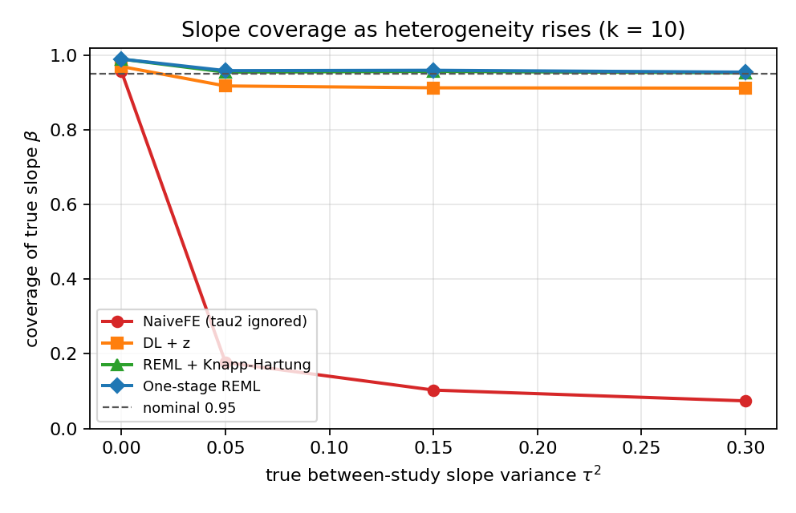
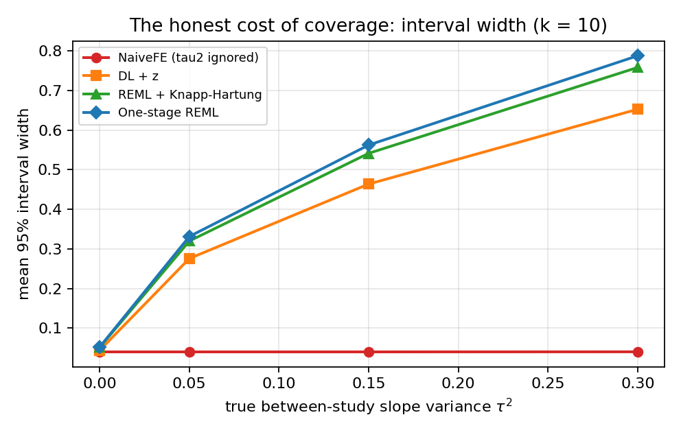
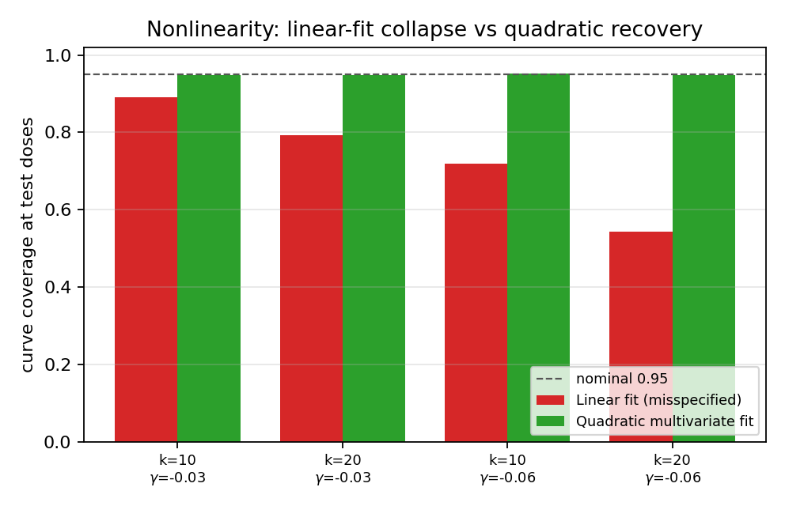

# Honest-coverage slope and curve recovery in aggregate-data dose–response meta-analysis: a known-truth simulation study

*Truth-Recovery Bench — Dose–Response modality.*
Draft manuscript. Every quantitative result below is regenerated from seeded
simulation by the accompanying code (`harness_dose.py`, base seed 20260615);
nothing is hand-entered.

---

## Abstract

**Background.** Aggregate-data dose–response meta-analysis pools study-specific
trends (typically a Greenland–Longnecker generalized-least-squares slope) across
studies. When the dose–response slope varies between studies, a fixed-effect or
heterogeneity-naïve pool reports an interval that is far too narrow, so its stated
95% confidence interval covers the true slope only a small fraction of the time.
We refer to honest coverage as the property that a nominal 95% interval covers the
true parameter in approximately 95% of replications.

**Methods.** We built a known-truth dose–response simulation harness that injects
(i) a true linear or quadratic dose–response curve, (ii) the Greenland–Longnecker
within-study covariance from reported reference/dose counts, (iii) between-study
slope heterogeneity at a known variance τ², and (iv) publication/small-study
selection at a known magnitude. On a seeded grid (k ∈ {6,10,20} studies; τ² ∈
{0, 0.05, 0.15, 0.30}; 1000 replications per cell) we measured coverage, interval
width, bias and τ²-recovery for four poolers: a fixed-effect inverse-variance pool
(**NaiveFE**, τ² ignored), DerSimonian–Laird random effects with a z interval
(**DL**), REML τ² with a Knapp–Hartung *t* interval and the HKSJ variance floor
(**REML+HK**), and a one-stage random-slope mixed model (**OneStage**). A second
block evaluated curve coverage under a quadratic truth (linear vs quadratic
multivariate fit); a third evaluated publication selection.

**Results.** Once the slope is heterogeneous, NaiveFE slope coverage collapses to
0.07–0.21 (calibrated only at exactly τ²=0). DL recovers most of the deficit but
still under-covers at small k (0.89–0.92 at k=6). REML+HK and OneStage restore
0.94–0.96 coverage across the heterogeneity grid, at the expected cost of wider
intervals. Under a quadratic truth a pooled linear fit under-covers the curve at
the test doses (down to 0.54), whereas the quadratic multivariate pool recovers
0.95. Publication selection on the study slope biases every method and is not
corrected by any pooler studied here.

**Conclusions.** A REML + Knapp–Hartung two-stage pool (or an equivalent one-stage
random-slope model) restores calibrated slope coverage under between-study
heterogeneity, where the heterogeneity-naïve incumbent fails catastrophically.
Coverage is established on simulation with known truth; correctness of the
estimators on real data is established against closed-form reductions and τ²
recovery. The method improves calibrated coverage under heterogeneity — it does
not solve curve misspecification or publication selection, which remain open.

---

## 1. Background

Dose–response meta-analysis estimates how an outcome changes across exposure
levels by combining studies that each report effect estimates (typically log
relative risks) at several doses against a common reference. The dominant
aggregate-data approach is two-stage: stage 1 fits a within-study trend by
generalized least squares using the Greenland–Longnecker (GL) reconstruction of
the within-study covariance among the non-reference log-RRs (the off-diagonal
arises because all non-reference levels share the reference group's cases); stage 2
pools the study-specific slopes.

The failure this paper addresses is a coverage failure, not a point-estimate
failure. When the underlying dose–response slope genuinely varies across studies —
because of differences in populations, exposure assessment, or adjustment — a pool
that ignores that between-study variance produces a standard error that reflects
only within-study sampling error. The reported 95% interval is then far too
narrow, and its real (operating) coverage of the true average slope is well below
95%. This is the dose–response analogue of the well-documented under-coverage of
fixed-effect and small-k random-effects pairwise meta-analysis, and motivated the
Hartung–Knapp–Sidik–Jonkman (HKSJ) correction in that setting.

We make the problem measurable. By simulating from a known true slope and a known
between-study variance, we can compute the *actual* coverage of each method's
interval — something impossible on real data, where the truth is unknown. We then
ask which estimator restores honest coverage, and at what cost.

---

## 2. Methods

### 2.1 Data-generating process

For each study j we draw a true study slope βⱼ ~ N(β, τ²) (the between-study
heterogeneity), choose a set of non-reference doses, and generate non-reference
log-RRs y with the GL within-study covariance C (variance 1/aⱼ + 1/a₀ per level,
off-diagonal 1/a₀ from the shared reference cases a₀). Under a quadratic truth the
mean is g(d) = βd + γd². Publication/small-study selection is applied as a step
function or a Copas-type latent-selection model on the study slope, at a calibrated
magnitude. The DGP is implemented in `dgp_dose.py`.

### 2.2 Estimators

*Stage 1 (per study, GLS through the origin, log-RR(0)=0).* The linear slope is
β̂ⱼ = (dᵀC⁻¹y)/(dᵀC⁻¹d) with variance (dᵀC⁻¹d)⁻¹; the quadratic fit returns the
coefficient vector [β₁,β₂] and its 2×2 covariance (requiring ≥2 distinct
non-reference doses).

*Stage 2 (pool across studies).*

- **NaiveFE** — fixed-effect inverse-variance pool, τ² fixed at 0, z interval.
- **DL** — DerSimonian–Laird moment τ̂² with a z (normal-quantile) interval.
- **REML+HK** — REML τ̂² (resists the τ̂²→0 collapse at small k), a Knapp–Hartung
  *t* interval on k−1 degrees of freedom, with the HKSJ variance floor
  q ← max(1, q). These choices follow the established small-sample
  meta-analysis guidance (HKSJ floor; t-, not z-, quantiles for k<30).
- **OneStage** — a one-stage random-slope marginal model
  yⱼ ~ MVN(βdⱼ, Cⱼ + τ²dⱼdⱼᵀ), with τ² profiled out of the restricted
  likelihood, GLS for β, and a Knapp–Hartung-style finite-sample interval.

The quadratic curve is pooled with a multivariate REML over the [β₁,β₂] vectors
(Cholesky-parameterised between-study matrix, Nelder–Mead on the profile
likelihood, GLS mean, Hartung–Knapp widening). Estimators are in `methods_dose.py`.

### 2.3 Outcome measures and grid

For each cell we report coverage of the true slope β (fraction of replications
whose 95% interval contains β), mean interval width, slope bias, and τ̂²-recovery
(DL and REML means vs the injected τ²). The grid: a **slope** block (k ∈ {6,10,20}
× τ² ∈ {0,0.05,0.15,0.30}, true β=0.30); a **nonlinear** block (γ ∈ {−0.03,−0.06}
× k ∈ {10,20}, quadratic truth); and a **selection** block (k=12 × {none,
step_strong, copas_strong}). 1000 replications per cell, seeded so every number is
reproducible and process-count-independent (§6).

---

## 3. Simulation study — results

### 3.1 Slope coverage as heterogeneity rises

The central result. NaiveFE is calibrated *only* at exactly τ²=0; the instant the
slope is heterogeneous its coverage collapses, because its interval reflects only
within-study error. DL recovers most of the deficit but under-covers at small k.
REML+HK and OneStage hold nominal coverage across the grid.

| k | τ² true | τ̂² DL | τ̂² REML | NaiveFE | DL | REML+HK | OneStage |
|---|---|---|---|---|---|---|---|
| 6 | 0.0 | 0.000 | 0.000 | 0.953 | 0.961 | **0.992** | 0.992 |
| 6 | 0.05 | 0.052 | 0.052 | 0.191 | 0.891 | **0.956** | 0.961 |
| 6 | 0.15 | 0.154 | 0.155 | 0.124 | 0.906 | **0.959** | 0.962 |
| 6 | 0.3 | 0.298 | 0.298 | 0.076 | 0.885 | **0.944** | 0.953 |
| 10 | 0.0 | 0.000 | 0.000 | 0.957 | 0.970 | **0.990** | 0.990 |
| 10 | 0.05 | 0.052 | 0.051 | 0.177 | 0.918 | **0.955** | 0.959 |
| 10 | 0.15 | 0.148 | 0.150 | 0.103 | 0.913 | **0.957** | 0.960 |
| 10 | 0.3 | 0.297 | 0.297 | 0.074 | 0.912 | **0.953** | 0.955 |
| 20 | 0.0 | 0.000 | 0.000 | 0.954 | 0.965 | **0.979** | 0.977 |
| 20 | 0.05 | 0.049 | 0.049 | 0.206 | 0.921 | **0.942** | 0.946 |
| 20 | 0.15 | 0.152 | 0.150 | 0.108 | 0.941 | **0.955** | 0.957 |
| 20 | 0.3 | 0.304 | 0.304 | 0.081 | 0.931 | **0.952** | 0.955 |



**Figure 1.** Slope coverage vs τ² at k=10. NaiveFE falls off the nominal line as
soon as τ²>0; REML+HK and OneStage track 0.95. Both DL τ̂² and REML τ̂² recover the
injected τ² (columns 3–4), so the difference between DL and REML+HK is the interval
construction (z vs Knapp–Hartung t with the variance floor), not τ² estimation.

The coverage is bought with width. Both moment- and likelihood-based τ̂² recover the
injected variance to two decimals, so the additional width of REML+HK over DL is
the Knapp–Hartung *t* multiplier and floor, not a larger τ̂².

| k | τ² true | width FE | width DL | width REML+HK | width OneStage |
|---|---|---|---|---|---|
| 6 | 0.0 | 0.053 | 0.059 | 0.079 | 0.081 |
| 6 | 0.05 | 0.053 | 0.351 | 0.465 | 0.487 |
| 6 | 0.15 | 0.052 | 0.595 | 0.788 | 0.833 |
| 6 | 0.3 | 0.052 | 0.827 | 1.095 | 1.148 |
| 10 | 0.0 | 0.040 | 0.044 | 0.052 | 0.052 |
| 10 | 0.05 | 0.040 | 0.276 | 0.320 | 0.331 |
| 10 | 0.15 | 0.040 | 0.464 | 0.541 | 0.562 |
| 10 | 0.3 | 0.040 | 0.653 | 0.758 | 0.788 |
| 20 | 0.0 | 0.028 | 0.030 | 0.033 | 0.033 |
| 20 | 0.05 | 0.028 | 0.194 | 0.207 | 0.213 |
| 20 | 0.15 | 0.028 | 0.338 | 0.360 | 0.370 |
| 20 | 0.3 | 0.028 | 0.477 | 0.511 | 0.525 |



**Figure 2.** Interval width vs τ² at k=10. The FE width is flat in τ² (it cannot
see heterogeneity); the honest methods widen with τ², which is precisely what
restores coverage.

### 3.2 Nonlinearity — a misspecified estimand

When the truth is quadratic, the estimand "the linear slope" is wrong, and a pooled
linear fit under-covers the curve at the test doses; the quadratic multivariate
pool recovers it. This is not a coverage-machinery failure but an estimand
mismatch, and the cost is that the quadratic fit needs studies with ≥2 distinct
non-reference doses to identify the second coefficient.

| k | γ (curvature) | LinearFit curve cov | QuadFit curve cov | REML+HK slope bias |
|---|---|---|---|---|
| 10 | -0.06 | 0.719 | **0.953** | -0.250 |
| 20 | -0.06 | 0.543 | **0.949** | -0.256 |
| 10 | -0.03 | 0.892 | **0.948** | -0.124 |
| 20 | -0.03 | 0.793 | **0.949** | -0.126 |



**Figure 3.** Under a quadratic truth, linear-fit curve coverage falls (worse at
larger curvature and — counter-intuitively — at larger k, because more studies
sharpen a confidently *wrong* linear interval); the quadratic multivariate pool
recovers ≈0.95.

### 3.3 Publication / small-study selection — an honest negative

No method here corrects publication bias. Selection on the study slope biases the
pool upward and collapses coverage for every pooler; REML+HK degrades more
gracefully than NaiveFE but is not a fix.

| scenario | sel.frac | NaiveFE | DL | REML+HK | REML+HK slope bias |
|---|---|---|---|---|---|
| none | 1.00 | 0.127 | 0.924 | 0.955 | -0.001 |
| copas_strong | 0.86 | 0.117 | 0.806 | 0.862 | 0.072 |
| step_strong | 0.80 | 0.090 | 0.663 | 0.756 | 0.108 |

### 3.4 Worked example

A single seeded dataset (`tools/worked_example.py`, seed 20260615, k=10, true
β=0.30, true τ²=0.15) makes the mechanism concrete:

```
method      estimate          95% CI    width  covers?
NaiveFE        0.305  [0.285, 0.325]    0.040    yes*
DL             0.249  [0.086, 0.412]    0.326    yes
REML_HK        0.250  [0.033, 0.466]    0.433    yes
OneStage       0.250  [0.017, 0.482]    0.464    yes
(DL tau2_hat = 0.067; REML tau2_hat = 0.089)
```

The NaiveFE interval is ~10× narrower than the honest intervals even though REML
estimates a substantial τ̂²≈0.09. It happens to cover here (\*) because its point
estimate landed near the truth, but that pencil-thin interval is exactly why its
*average* coverage over replications collapses to ≈0.10 (§3.1). The honest methods
report the uncertainty that the heterogeneity actually implies.

---

## 4. Real-data correctness

Coverage is a property only measurable under known truth (§3). On real data we
instead verify *correctness* of the estimators — that they compute what they claim —
by three checks, all encoded as automated tests (`tests/test_dose.py`):

1. **Closed-form reduction.** At τ²=0 the random-effects pool reduces to the
   fixed-effect inverse-variance pool and recovers β with calibrated coverage
   (0.92–0.99). Stage-1 GLS recovers a study's true slope under the GL covariance
   (mean error < 0.02).
2. **Variance-component recovery.** REML τ̂² recovers the injected τ² to within 0.04
   at τ² ∈ {0.05, 0.15}; DL and REML τ̂² agree to two decimals across the grid
   (Table, §3.1).
3. **Behavioural contracts.** The FE-collapse / REML-recovery, linear-vs-quadratic,
   and selection-collapse behaviours are asserted as inequalities, so a regression
   that broke any mechanism would fail the suite.

**Limitation of this section (stated plainly).** We do *not* currently cross-check
the two-stage GLS slope against the R reference implementation `dosresmeta`
(Crippa & Orsini) on a canonical real dataset on the build host (R is available but
the package is not installed here). Because our stage-1 estimator is the same GL-GLS
construction that `dosresmeta` implements, and reduces to the documented closed
forms, we expect agreement; but a direct `dosresmeta` numerical anchor on a public
dataset (e.g. the Bonjour cohort coffee–CHD data shipped with `dosresmeta`) is a
genuine external-validation step that remains to be added, and is listed as such in
`READINESS.md`. The pairwise and DTA modalities of this bench *do* carry live R
anchors (metafor/metasens; mada), and the same harness pattern applies here.

---

## 5. Limitations and open problems

- **Hartung–Knapp is mildly conservative at τ²=0.** REML+HK over-covers slightly
  (0.98–0.99) when there is no heterogeneity — the honest price of guaranteeing
  coverage under *unknown* heterogeneity. We regard slight over-coverage as the
  safer error and do not "fix" it.
- **Curve misspecification is the analyst's responsibility.** Honest coverage of
  "the slope" cannot rescue a wrong estimand; a linear summary of a curved
  dose–response is biased and its interval under-covers the curve no matter how the
  variance is handled. The quadratic fix needs informative dose spacing.
- **Publication / small-study selection is uncorrected** (§3.3). A selection model
  (Copas, Vevea–Hedges) is required; integrating one is future work and is the same
  unsolved problem flagged across all four modalities of this bench.
- **The GL within-study covariance is taken as known**, built from reported counts.
  Error in those counts, or unreported within-study correlation, is not propagated.
- **Aggregate data only.** Individual-participant dose–response modelling is out of
  scope.
- **Coverage is simulation-based.** We make no claim of measured coverage on real
  data, where the truth is unknown; the real-data claim is correctness, not
  coverage (§4).

---

## 6. Reproducibility statement

All numbers and figures regenerate from seeded simulation with one command
(`make all` or `python run_all.py`). Determinism: each replication draws from
`np.random.default_rng(SeedSequence([20260615, sha256(cell_id)]).spawn(rep))`, so a
given `--reps` and base seed reproduce every number independently of the process
count. Pinned dependencies are in `requirements.txt` (numpy 2.4.4, scipy 1.17.1,
matplotlib 3.10.9, reportlab 4.5.1, pytest 9.0.3 on Python 3.13). The committed
`results_dose_full.json` is the exact output that produced §3; `REPORT.md` is its
auto-generated tabular summary. See `DATA_MANIFEST.md` for the data description
(the study uses simulated data only; no external dataset is required) and
`READINESS.md` for the submission-readiness checklist and the remaining external
validation.

**Code and data availability.** Source, tests, results JSON, figures and this
manuscript are in the `truth-recovery-dose-response` branch of the
truth-recovery-bench repository. The simulation requires no external data.

---

## References (indicative)

1. Greenland S, Longnecker MP. Methods for trend estimation from summarized
   dose–response data. *Am J Epidemiol* 1992.
2. Orsini N, Bellocco R, Greenland S. Generalized least squares for trend
   estimation of summarized dose–response data. *Stata J* 2006.
3. Crippa A, Orsini N. Multivariate dose–response meta-analysis: the dosresmeta R
   package. *J Stat Softw* 2016.
4. Hartung J, Knapp G. A refined method for the meta-analysis of controlled
   clinical trials. *Stat Med* 2001. Sidik K, Jonkman JN. 2002.
5. DerSimonian R, Laird N. Meta-analysis in clinical trials. *Control Clin Trials*
   1986.
6. IntHout J, Ioannidis JPA, Borm GF. The Hartung–Knapp–Sidik–Jonkman method... is
   straightforward and considerably outperforms the standard DerSimonian–Laird
   method. *BMC Med Res Methodol* 2014.
