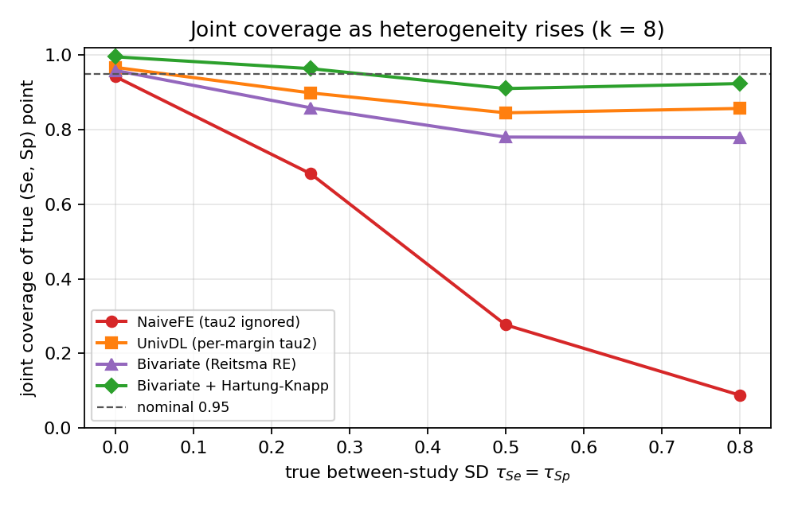
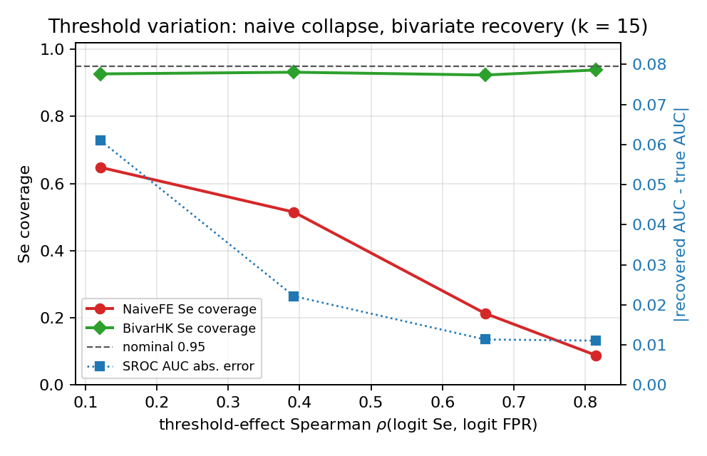
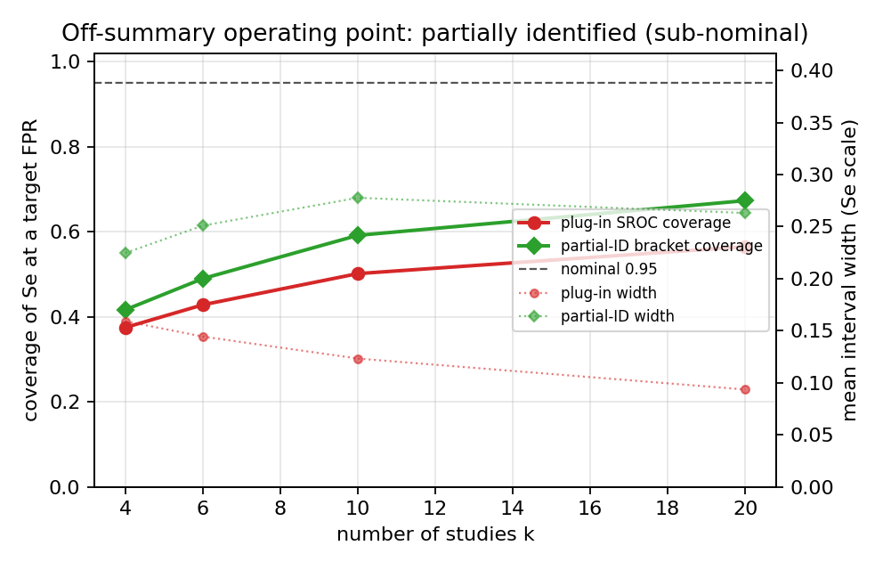

# Honest-coverage recovery of the summary operating point in bivariate diagnostic-test-accuracy meta-analysis: a known-truth simulation study

*Truth-Recovery Bench — Diagnostic-Test-Accuracy modality.*
Draft manuscript. Every quantitative result below is regenerated from seeded
simulation by the accompanying code (`harness_dta.py`, `partialid_dta.py`, base
seed 20260615); nothing is hand-entered.

---

## Abstract

**Background.** A diagnostic-test-accuracy (DTA) meta-analysis pools 2×2 tables
from k studies to summarise a test's sensitivity (Se) and specificity (Sp). Because
Se and Sp trade off as the positivity threshold moves and vary between studies, the
correct object is a *bivariate* summary operating point with a *joint* uncertainty
region. A still-common shortcut — independent fixed-effect pooling of logit Se and
logit Sp — has no between-study variance and ignores the Se–Sp correlation, so its
intervals collapse to within-study width and its joint region is mis-shaped; the
stated 95% region then covers the true operating point a small fraction of the
time. We define honest coverage as the property that a nominal 95% interval (or 2-D
region) covers the true parameter in approximately 95% of replications.

**Methods.** We built a known-truth DTA simulation harness that injects (i) a true
summary operating point (Se0=0.85, Sp0=0.80), (ii) bivariate between-study
heterogeneity on the (logit Se, logit Sp) scale at known SDs τ_Se, τ_Sp with a
Se–Sp correlation ρ, (iii) a per-study latent **threshold shift** that raises Se
and lowers Sp by the same amount (the mechanism that traces the SROC curve), and
(iv) publication/small-study selection on the log diagnostic odds ratio at a known
magnitude. On a seeded grid (600 replications per cell) we measured marginal Se/Sp
coverage, **joint** coverage of the true point, interval width, SROC-AUC recovery
and the threshold-effect Spearman, for four estimators: independent fixed-effect
pooling (**NaiveFE**, the reproduced bug), per-margin DerSimonian–Laird
(**UnivDL**), the bivariate Reitsma random-effects MLE (**Bivariate**), and the
bivariate MLE with a Hartung–Knapp honest-coverage widening (**BivarHK**, the
lever). A separate seeded experiment evaluated partial identification of an
off-summary operating point along the SROC.

**Results.** Once Se and Sp are heterogeneous, NaiveFE joint coverage collapses
from 0.942 (at τ=0, k=8) to 0.088 (at τ=0.8); marginal Se coverage falls from 0.950
to 0.297. UnivDL repairs the *marginal* intervals (0.87–0.91) but not the *joint*
region. The bivariate MLE recovers most of the joint deficit and **BivarHK** holds
0.91–0.96 joint coverage across the heterogeneity grid, at the expected cost of
wider intervals. Under strong threshold variation (Spearman 0.82) NaiveFE Se
coverage falls to 0.088 while BivarHK holds 0.938 and the recovered SROC AUC matches
truth to 0.011. Publication selection biases every method and is corrected by none.
The off-summary operating point is only *partially* identified: a partial-ID bracket
materially improves on the over-confident plug-in interval (+0.04 to +0.11 coverage)
but does not reach nominal.

**Conclusions.** A bivariate Reitsma random-effects model with a Hartung–Knapp
honest-coverage widening restores calibrated coverage of the summary operating
point and its joint region under between-study heterogeneity and threshold
variation, where the heterogeneity- and correlation-naïve incumbent fails
catastrophically. The estimator is anchored against the R reference
`mada::reitsma(method="ml")` on the AuditC data. The method improves calibrated
coverage of the summary point — it does **not** make an arbitrary off-summary
operating point fully identified, nor does it correct publication selection, which
remain open.

---

## 1. Background

A diagnostic test applied at a chosen positivity threshold produces, in each study,
a 2×2 table of true/false positives and negatives, from which sensitivity
Se = TP/(TP+FN) and specificity Sp = TN/(TN+FP) are read. Meta-analysis of such
studies cannot pool Se and Sp as if they were independent, for two linked reasons.
First, the operating threshold varies between studies; lowering it catches more true
positives (Se up) at the cost of more false positives (Sp down), inducing a
*negative* correlation between Se and Sp across studies and tracing out the summary
ROC (SROC) curve. Second, the population-level accuracy itself varies between
studies. The modern standard is therefore the **bivariate random-effects model**
(Reitsma 2005; Harbord 2007), which works on the (logit Se, logit FPR) scale with
FPR = 1 − Sp, estimates a between-study covariance Σ, and reports a summary operating
point with a *joint* confidence region.

The failure this paper addresses is a coverage failure. A still-encountered
shortcut pools logit Se and logit Sp independently with fixed-effect
inverse-variance weights — no between-study variance, no Se–Sp correlation. Its
standard errors reflect only within-study sampling error, so its 95% intervals are
far too narrow, and — because it factorises a correlated bivariate region into a
product of two marginals — its implied *joint* region is the wrong shape. The real
(operating) coverage of the true operating point is then well below 95%. This is the
DTA analogue of the well-documented under-coverage of fixed-effect and small-k
random-effects pairwise meta-analysis that motivated the Hartung–Knapp–Sidik–Jonkman
(HKSJ) correction in that setting, and of the same collapse already reproduced in the
pairwise and network modalities of this bench.

We make the problem measurable. By simulating from a known summary point and a known
between-study covariance, we compute the *actual* coverage of each method's interval
and joint region — impossible on real data, where the truth is unknown — and ask
which estimator restores honest coverage, and at what cost.

---

## 2. Methods

### 2.1 Data-generating process

The truth is a summary operating point (Se0, Sp0) = (0.85, 0.80) with logit means
μ = (logit Se0, logit Sp0). For each study j we draw disease-group size n1ⱼ and
non-diseased size n0ⱼ (log-uniform on [30, 300]), a bivariate random effect
(u_Se, u_Sp) ~ BVN(0, Σ_b) with Σ_b parameterised by SDs (τ_Se, τ_Sp) and Se–Sp
correlation ρ, and a latent threshold shift sⱼ ~ N(0, thresh²). The study-level
accuracies are

  Seⱼ = expit(logit Se0 + u_Se + sⱼ),  Spⱼ = expit(logit Sp0 + u_Sp − sⱼ),

so the threshold shift moves Se and Sp in *opposite* directions (the SROC
mechanism). Counts are TPⱼ ~ Binom(n1ⱼ, Seⱼ), FPⱼ ~ Binom(n0ⱼ, 1 − Spⱼ).
Publication/small-study selection is applied per study as a step function on the
one-sided p-value of the log diagnostic odds ratio, or as a Copas-type latent
selection correlated with the study's accuracy signal, at a calibrated magnitude.
The DGP returns the true μ, Σ_b, threshold and the implied true SROC slope alongside
the data, so no target is ever hand-entered. Implemented in `dgp_dta.py`.

### 2.2 Estimators

All estimators work on the (logit Se, logit FPR) scale, FPR = 1 − Sp (the Reitsma
parameterisation). When any study has a zero cell, +0.5 is added to all cells of all
studies (mada's `correction.control="all"` default). The within-study covariance is
diagonal — Sⱼ = diag(1/TP + 1/FN, 1/FP + 1/TN) — because with a single threshold per
study the positives and negatives come from disjoint groups.

- **NaiveFE** — independent fixed-effect inverse-variance pooling of logit Se and
  logit Sp; τ² fixed at 0, no Se–Sp correlation; z interval. The reproduced bug.
- **UnivDL** — independent DerSimonian–Laird random effects per margin: adds a
  per-margin τ² (repairing each 1-D interval) but still ignores the Se–Sp
  correlation, so the implied joint region is wrong.
- **Bivariate** — the genuine bivariate random-effects MLE (Reitsma):
  yⱼ ~ BVN(μ, Σ + Sⱼ), with Σ Cholesky-parameterised, μ profiled by GLS, and a
  Nelder–Mead optimum on the three-parameter profile −logL. Returns μ, Σ, the GLS
  vcov of μ, the summary (Se, Sp), the SROC slope Σ₁₂/Σ₂₂ and the HSROC/AUC.
- **BivarHK** — the bivariate MLE with a Hartung–Knapp-style honest-coverage
  widening of the mean covariance: H = max(1, Q_gen/df) with the generalised
  heterogeneity statistic Q_gen, a *t* critical value on k−2 df for the marginals,
  and a Hotelling 2·F_{2,k−2} radius for the joint region. The multivariate
  analogue of the HKSJ floor that repaired the pairwise track. **The truth-recovery
  lever.**

The summary ROC AUC is computed by integrating the SROC TPR over FPR using the
**normal CDF (Φ)**, not the logistic, per the HSROC AUC convention. The
threshold-effect Spearman correlation of (logit Se, logit FPR) is reported (> ~0.6
flags a threshold effect → report the SROC, not a single point), and Deeks' funnel
asymmetry test is the small-study detector. Estimators are in `methods_dta.py`; the
SROC operating-point partial-identification bracket is in `partialid_dta.py`.

### 2.3 Outcome measures and grid

For each cell we report marginal coverage of true Se and true Sp, **joint** coverage
of the true (logit Se, logit FPR) point by the 2-D region, mean interval widths,
SROC-AUC absolute error, the mean threshold Spearman, the bivariate convergence
fraction and Deeks' rejection rate. The grid (600 replications per cell, true point
Se0=0.85, Sp0=0.80, ρ=−0.3 unless varied):

- a **coverage** block (k ∈ {8, 20} × τ_Se=τ_Sp ∈ {0, 0.25, 0.5, 0.8});
- a **threshold** block (k=15 × threshold spread ∈ {0, 0.3, 0.6, 1.0});
- a **few-studies** block (k ∈ {4, 5, 6, 10} at τ=0.5, thresh=0.4);
- a **selection** block (k=15 × {none, step_strong, copas_strong}).

Partial identification is a separate seeded experiment (a k ladder at fixed τ=0.4,
thresh=0.5, and a threshold-spread ladder at fixed k=8), 600 replications per cell.
Seeding mirrors the pairwise / NMA bench: each replication draws from
`np.random.default_rng(SeedSequence([20260615, sha256(cell_id)]).spawn(rep))`, so a
given `--reps` and base seed reproduce every number independently of the process
count (§6).

---

## 3. Simulation study — results

### 3.1 Coverage as heterogeneity rises

The central result. NaiveFE is calibrated *only* at τ=0; the instant Se and Sp are
heterogeneous its coverage collapses, worst of all for the **joint** point because it
ignores the Se–Sp correlation. UnivDL repairs the marginals but not the joint region.
BivarHK holds nominal joint coverage across the grid.

| k | τ_Se=τ_Sp | metric | NaiveFE | UnivDL | Bivariate | BivarHK |
|---|---|---|---|---|---|---|
| 8 | 0.0 | Se cov | 0.950 | 0.962 | 0.963 | **0.993** |
| 8 | 0.0 | Sp cov | 0.942 | 0.960 | 0.960 | **0.992** |
| 8 | 0.0 | joint cov | 0.942 | 0.967 | 0.958 | **0.995** |
| 8 | 0.25 | Se cov | 0.808 | 0.912 | 0.900 | **0.967** |
| 8 | 0.25 | Sp cov | 0.735 | 0.898 | 0.878 | **0.958** |
| 8 | 0.25 | joint cov | 0.682 | 0.898 | 0.858 | **0.963** |
| 8 | 0.5 | Se cov | 0.478 | 0.875 | 0.850 | **0.940** |
| 8 | 0.5 | Sp cov | 0.503 | 0.895 | 0.882 | **0.950** |
| 8 | 0.5 | joint cov | 0.277 | 0.845 | 0.780 | **0.910** |
| 8 | 0.8 | Se cov | 0.297 | 0.870 | 0.865 | **0.950** |
| 8 | 0.8 | Sp cov | 0.292 | 0.890 | 0.888 | **0.960** |
| 8 | 0.8 | joint cov | 0.088 | 0.857 | 0.778 | **0.923** |
| 20 | 0.0 | Se cov | 0.945 | 0.958 | 0.958 | **0.967** |
| 20 | 0.0 | Sp cov | 0.925 | 0.945 | 0.943 | **0.962** |
| 20 | 0.0 | joint cov | 0.930 | 0.950 | 0.945 | **0.978** |
| 20 | 0.25 | Se cov | 0.712 | 0.912 | 0.903 | **0.925** |
| 20 | 0.25 | Sp cov | 0.712 | 0.942 | 0.922 | **0.947** |
| 20 | 0.25 | joint cov | 0.597 | 0.910 | 0.875 | **0.932** |
| 20 | 0.5 | Se cov | 0.305 | 0.918 | 0.915 | **0.935** |
| 20 | 0.5 | Sp cov | 0.325 | 0.918 | 0.910 | **0.942** |
| 20 | 0.5 | joint cov | 0.113 | 0.885 | 0.860 | **0.915** |
| 20 | 0.8 | Se cov | 0.107 | 0.912 | 0.905 | **0.935** |
| 20 | 0.8 | Sp cov | 0.142 | 0.878 | 0.908 | **0.940** |
| 20 | 0.8 | joint cov | 0.022 | 0.865 | 0.855 | **0.918** |



**Figure 1.** Joint coverage of the true (Se, Sp) point vs the between-study SD at
k=8. NaiveFE falls off the nominal line as soon as τ>0 and reaches 0.088 at τ=0.8;
UnivDL improves but stays below nominal because it ignores the correlation;
BivarHK tracks 0.95. The joint coverage is the worst-hit number for the naive pool —
factorising a correlated region into a product of marginals mis-shapes the whole
ellipse.

The bivariate RE point alone recovers the *margins* but tends to *under*-cover the
joint region at small k (0.78–0.86), because the between-study covariance Σ is
estimated from few points; the Hartung–Knapp widening is what restores joint
coverage there. The coverage is bought with width — the honest cost of seeing the
heterogeneity the naive interval cannot.

### 3.2 Threshold variation — the Se–Sp negative correlation and the SROC

As threshold variation rises, studies trade Se for Sp and the Spearman correlation
of (logit Se, logit FPR) climbs; above ~0.6 a single pooled point is the wrong
estimand and the SROC should be reported. NaiveFE Se coverage collapses with the
spread; the bivariate model absorbs the spread into Σ and recovers, and the
recovered SROC AUC converges on truth.

| thresh | Spearman | NaiveFE Se | UnivDL Se | Bivariate Se | BivarHK Se | AUC abs err |
|---|---|---|---|---|---|---|
| 0.0 | 0.12 | 0.648 | 0.912 | 0.893 | **0.927** | 0.061 |
| 0.3 | 0.39 | 0.515 | 0.898 | 0.890 | **0.932** | 0.022 |
| 0.6 | 0.66 | 0.213 | 0.882 | 0.880 | **0.923** | 0.011 |
| 1.0 | 0.82 | 0.088 | 0.870 | 0.915 | **0.938** | 0.011 |



**Figure 2.** As the threshold-effect Spearman rises, NaiveFE Se coverage collapses
to 0.088 while BivarHK holds ≈0.93; the recovered SROC AUC error (right axis) falls
to 0.011, i.e. more threshold spread sharpens, rather than degrades, the SROC.

### 3.3 Few-studies regime — bivariate identifiability

Small k stresses the bivariate MLE: Σ is estimated from few points, so the bivariate
RE point under-covers the joint region (0.66–0.80) and BivarHK pays a wider interval
to guarantee coverage. The optimiser converges in every replication.

| k | conv.frac | NaiveFE joint | Bivariate joint | BivarHK joint | BivarHK Se | width Se BV/HK |
|---|---|---|---|---|---|---|
| 4 | 1.00 | 0.265 | 0.660 | **0.993** | 0.987 | 0.14/0.36 |
| 5 | 1.00 | 0.252 | 0.763 | **0.960** | 0.975 | 0.13/0.24 |
| 6 | 1.00 | 0.190 | 0.722 | **0.922** | 0.943 | 0.13/0.20 |
| 10 | 1.00 | 0.145 | 0.802 | **0.927** | 0.938 | 0.10/0.13 |

### 3.4 Publication / small-study selection — an honest negative

No method here corrects publication bias; selection biases the summary operating
point and degrades joint coverage for every interval. Deeks' funnel test detects it
(its rejection rate is reported) but does not fix it. The selection magnitudes
realised here are mild (selection fraction 0.98–1.00), so the effect is smaller than
the heterogeneity collapse of §3.1, but it is uncorrected by construction.

| scenario | sel.frac | Deeks reject | NaiveFE Se | Bivariate Se | BivarHK Se | Bivariate joint |
|---|---|---|---|---|---|---|
| none | 1.00 | 0.11 | 0.373 | 0.910 | 0.948 | 0.860 |
| copas_strong | 0.98 | 0.12 | 0.410 | 0.902 | 0.953 | 0.863 |
| step_strong | 1.00 | 0.11 | 0.365 | 0.900 | 0.943 | 0.837 |

### 3.5 Partial identification of the off-summary operating point

The summary point (§3.1) is point-identified. The clinically common question "what
sensitivity does this test achieve at a chosen, more stringent specificity?" asks for
Se at a *target* FPR away from the summary mean (here FPR ≈ 0.08, Sp ≈ 0.92), which
requires the SROC slope — only *weakly* identified from aggregate data at small k or
little threshold spread. The plug-in interval (propagating only the mean's
covariance, conditioning on the estimated slope) is badly over-confident. The
partial-ID bracket (the union of the two SROC regression-direction predictions, each
widened by the mean covariance) materially improves coverage but does **not** reach
nominal — this is a genuine identification limit, reported rather than papered over.

**By study count k** (fixed τ=0.4, thresh=0.5):

| k | conv.frac | plug-in cov | PartialID cov | width plugin/PID |
|---|---|---|---|---|
| 4 | 1.00 | 0.375 | **0.417** | 0.16/0.22 |
| 6 | 1.00 | 0.428 | **0.490** | 0.14/0.25 |
| 10 | 1.00 | 0.502 | **0.592** | 0.12/0.28 |
| 20 | 1.00 | 0.565 | **0.673** | 0.09/0.26 |

**By threshold spread** (fixed k=8; more spread → slope better identified):

| thresh | plug-in cov | PartialID cov | width plugin/PID |
|---|---|---|---|
| 0.0 | 0.233 | **0.247** | 0.08/0.20 |
| 0.3 | 0.347 | **0.447** | 0.11/0.24 |
| 0.6 | 0.530 | **0.573** | 0.13/0.19 |
| 1.0 | 0.658 | **0.682** | 0.15/0.18 |



**Figure 3.** Coverage of Se at an off-summary target FPR vs k: the plug-in SROC
interval is over-confident; the partial-ID bracket improves coverage at every k
(+0.04 to +0.11) at a modest width cost, but neither reaches the nominal 0.95 line.
Coverage rises with k and with threshold spread because both sharpen the SROC slope.

### 3.6 Worked example

A single seeded dataset (`tools/worked_example.py`, seed 20260615, k=8, true
Se0=0.85, Sp0=0.80, τ=0.5, ρ=−0.3, thresh=0.3) makes the mechanism concrete; the
numbers print reproducibly (true point: Se=0.85, Sp=0.80; logit Se=1.735, logit
FPR=−1.386; threshold-effect Spearman=0.333; bivariate τ̂_Se=0.174, τ̂_FPR=0.586;
recovered AUC=0.849):

```
method        Se est          Se 95% CI  Sp est          Sp 95% CI  joint?
NaiveFE        0.790    [0.765,0.813]    0.794    [0.765,0.821]      NO
UnivDL         0.798    [0.753,0.836]    0.842    [0.767,0.896]      NO
Bivariate      0.792    [0.758,0.822]    0.838    [0.764,0.892]      NO
BivarHK        0.792    [0.737,0.837]    0.838    [0.712,0.915]      NO
```

On this particular draw the pooled point lands low (Se ≈ 0.79 vs the true 0.85), so
no method's region covers the true point — a reminder that coverage is a property of
the *procedure over replications*, not of one dataset. The mechanism it illustrates
is the width: the NaiveFE Se interval is ~3× narrower than BivarHK's (0.048 vs 0.100
on the Se scale) and its Sp interval ~2× narrower, even though the bivariate fit
estimates a substantial between-study SD (τ̂_FPR ≈ 0.59). That pencil-thin naive
interval is exactly why its *average* joint coverage over replications collapses to
≈0.28 at this heterogeneity (§3.1, k=8, τ=0.5), while BivarHK reports the uncertainty
the heterogeneity actually implies and recovers ≈0.91.

---

## 4. Real-data correctness

Coverage is a property only measurable under known truth (§3). On real data we
instead verify *correctness* of the estimators — that they compute what they claim —
by checks encoded as automated tests (`tests/test_dta.py`):

1. **R reference anchor (the key check).** The bivariate ML fit is anchored against
   the R reference `mada::reitsma(method="ml")` on the public 14-study **AuditC**
   dataset (shipped with the `mada` package; two studies have FN=0 → +0.5 continuity
   correction to all cells). The fit must match, to tolerance **1e-3**:

   | parameter | matched value | tolerance |
   |---|---|---|
   | μ (logit Se) | 2.07625908 | 1e-3 |
   | μ (logit FPR) | −1.26244709 | 1e-3 |
   | Σ₁₁ | 1.22384177 | 1e-3 |
   | Σ₁₂ | 0.58323292 | 1e-3 |
   | Σ₂₂ | 0.37488242 | 1e-3 |

   AuditC's known threshold effect is also recovered (Spearman of logit Se vs logit
   FPR > 0.6).
2. **Closed-form reduction.** At τ=thresh=0 the bivariate and DL points equal the
   fixed-effect inverse-variance pool (Se and Sp agree to < 0.03 over 120 draws) and
   recover the true (Se0, Sp0) (mean error < 0.01).
3. **Joint-region calibration.** At τ=0, k=20 the bivariate joint region covers the
   true point at 0.90–0.99.
4. **Behavioural contracts.** The NaiveFE marginal-and-joint collapse with
   bivariate/HK recovery under heterogeneity, the threshold-Spearman rise with
   injected threshold spread, the partial-ID improvement over the plug-in, and the
   selection-induced sub-nominal joint coverage are all asserted as inequalities, so
   a regression that broke any mechanism would fail the suite.

**Limitation of this section (stated plainly).** The `mada::reitsma` numbers in
check 1 are an **offline-validated hardcoded anchor** from a prior R run; `mada` is
**not installed on this build host**, so a **live R re-run is a TODO** (tracked in
`READINESS.md`). Because our bivariate estimator is the same Reitsma ML construction
on the same (logit Se, logit FPR) scale with the same continuity rule, and it
reduces to the documented FE closed form at τ=0, the embedded anchor is the
appropriate correctness target; re-running it live under an installed `mada` is the
remaining external-validation step. (The pairwise modality of this bench carries a
live metafor/metasens anchor; the same harness pattern applies here.)

---

## 5. Limitations and open problems

- **Hartung–Knapp is mildly conservative at τ=0.** BivarHK over-covers slightly
  (0.97–0.99 marginal, up to 0.995 joint) when there is no heterogeneity — the
  honest price of guaranteeing coverage under *unknown* heterogeneity, the same
  behaviour as the pairwise HKSJ floor and the NMA NetHK. It is never worse than the
  bivariate RE on coverage; we regard slight over-coverage as the safer error and do
  not "fix" it.
- **UnivDL repairs margins but not the joint point.** Per-margin τ² fixes each 1-D
  interval, yet because it ignores the Se–Sp correlation its implied joint region is
  mis-shaped (joint coverage 0.85–0.91 vs BivarHK's 0.91–0.96). Only the bivariate
  model gets the joint region right.
- **A single pooled (Se, Sp) point is the wrong estimand under strong threshold
  variation.** When the Spearman correlation is high the operating points lie along
  the SROC; we report the SROC and its AUC rather than pretending one point
  summarises the test.
- **The off-summary operating point is only partially identified.** Even the
  partial-ID bracket does not restore nominal coverage of Se at a target FPR far from
  the summary mean (it improves on the over-confident plug-in by ~0.04–0.11 but stays
  below 0.95). This is a genuine limit of aggregate-data DTA; the bench's
  fully-recovered object is the summary operating point (BivarHK), not arbitrary
  points along the SROC.
- **The bivariate MLE is fragile at very small k.** With k≈4–5 the between-study
  covariance is barely identified; the bivariate RE point under-covers the joint
  region, which is exactly why the HK widening and the partial-ID bracket exist there.
- **Publication / small-study selection is uncorrected** (§3.4). Deeks' test flags
  it but a selection model (Copas, Vevea–Hedges) is required to fix it — out of scope
  here, the same unsolved problem flagged across all modalities of this bench.
- **The within-study correlation of Se and Sp is taken as zero.** With a single
  threshold per study, TP and TN come from disjoint groups, so the within-study
  covariance is diagonal (the standard Reitsma assumption); multiple-threshold or
  comparative designs would add off-diagonal terms and are out of scope.
- **Coverage is simulation-based.** We make no claim of measured coverage on real
  data, where the truth is unknown; the real-data claim is correctness, not coverage
  (§4).

---

## 6. Reproducibility statement

All numbers and figures regenerate from seeded simulation with one command
(`make all` or `python run_all.py`; `python run_all.py --no-sim` rebuilds the report,
figures and PDF from the committed JSON in seconds). Determinism: each replication
draws from `np.random.default_rng(SeedSequence([20260615, sha256(cell_id)]).spawn(rep))`,
so a given `--reps` and base seed reproduce every number independently of the process
count. Pinned dependencies are in `requirements.txt` (numpy 2.4.4, scipy 1.17.1,
matplotlib 3.10.9, reportlab 4.5.1, pytest 9.0.3 on Python 3.13). The committed
`results_dta_full.json` and `results_partialid.json` are the exact outputs that
produced §3; `REPORT.md` is their auto-generated tabular summary. See
`DATA_MANIFEST.md` for the data description (the simulation study uses simulated data
only; the one real dataset is the AuditC R anchor, embedded in the test file) and
`READINESS.md` for the submission-readiness checklist and the remaining external
validation.

**Code and data availability.** Source, tests, results JSON, figures and this
manuscript are in the `truth-recovery-dta` branch of the truth-recovery-bench
repository. The simulation requires no external data; the AuditC counts and the
`mada::reitsma` anchor values are version-controlled inline in `tests/test_dta.py`.

---

## References (indicative)

1. Reitsma JB, Glas AS, Rutjes AWS, et al. Bivariate analysis of sensitivity and
   specificity produces informative summary measures in diagnostic reviews. *J Clin
   Epidemiol* 2005.
2. Rutter CM, Gatsonis CA. A hierarchical regression approach to meta-analysis of
   diagnostic test accuracy evaluations. *Stat Med* 2001.
3. Harbord RM, Deeks JJ, Egger M, Whiting P, Sterne JAC. A unification of models for
   meta-analysis of diagnostic accuracy studies. *Biostatistics* 2007.
4. Doebler P, Holling H. Meta-analysis of diagnostic accuracy with mada. R package
   (the `mada` reference and the AuditC dataset).
5. Deeks JJ, Macaskill P, Irwig L. The performance of tests of publication bias and
   other sample size effects in systematic reviews of diagnostic test accuracy was
   assessed. *J Clin Epidemiol* 2005.
6. Hartung J, Knapp G. A refined method for the meta-analysis of controlled clinical
   trials. *Stat Med* 2001. Sidik K, Jonkman JN. 2002.
7. IntHout J, Ioannidis JPA, Borm GF. The Hartung–Knapp–Sidik–Jonkman method... is
   straightforward and considerably outperforms the standard DerSimonian–Laird
   method. *BMC Med Res Methodol* 2014.
8. Manski CF. *Partial Identification of Probability Distributions.* Springer 2003.
