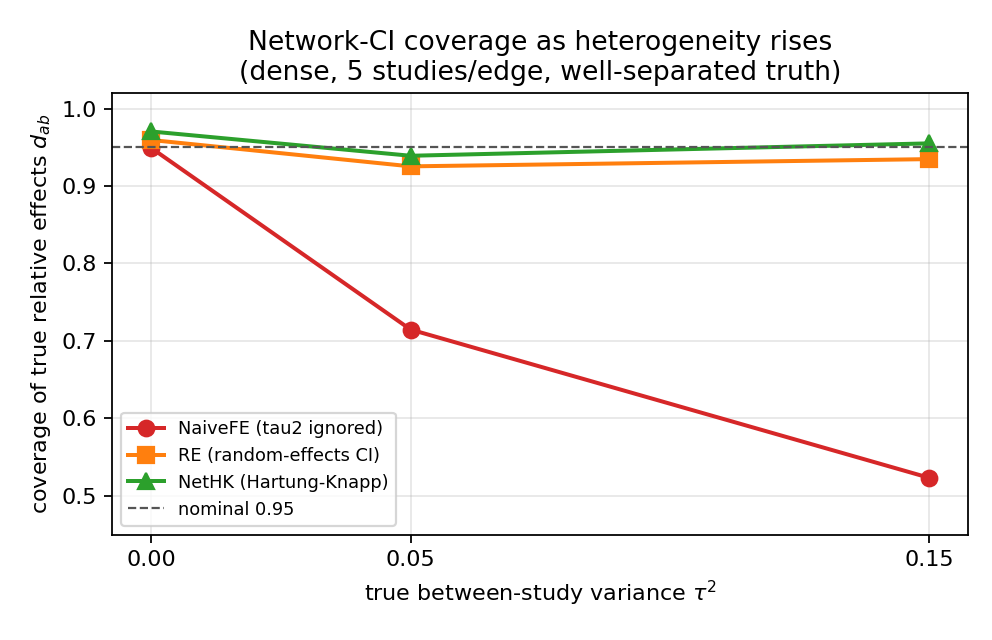
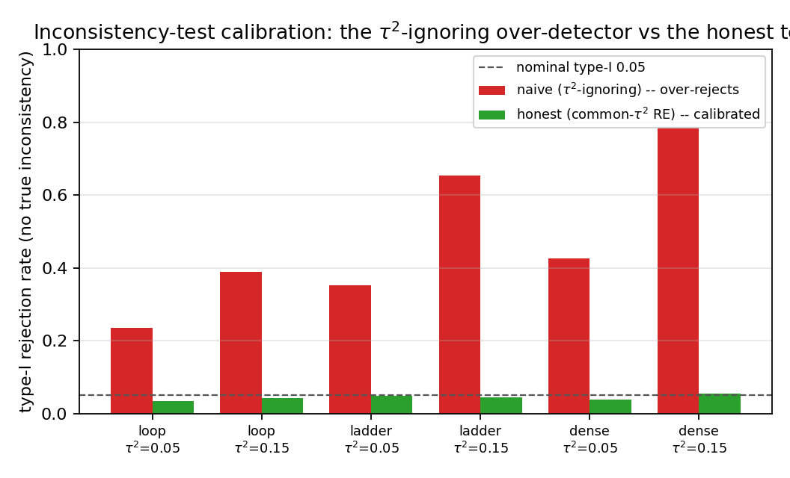
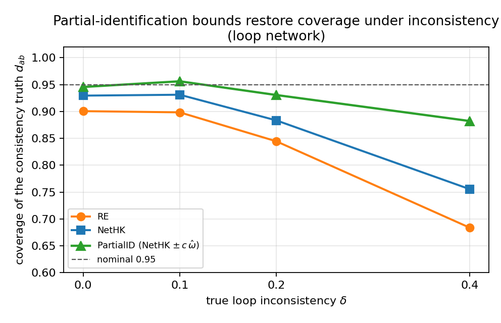

# Honest-coverage relative-effect recovery, calibrated inconsistency testing and non-over-confident ranking in network meta-analysis: a known-truth simulation study

*Truth-Recovery Bench — Network meta-analysis (NMA) modality.*
Draft manuscript. Every quantitative result below is regenerated from seeded
simulation by the accompanying code (`harness_nma.py`, `partialid_nma.py`, base
seed 20260615); nothing is hand-entered.

---

## Abstract

**Background.** Network meta-analysis (NMA) pools direct and indirect evidence to
estimate every pairwise relative effect among a set of treatments and to rank them.
Three failure modes recur in deployed NMA software: a fixed-effect confidence
interval that ignores between-study heterogeneity and therefore under-covers the
true relative effects; an inconsistency test that ignores heterogeneity and
therefore over-rejects (declares the network inconsistent when it is merely
heterogeneous); and a treatment ranking (SUCRA / P-score / posterior P(best)) that
is stated with far more confidence than the data support. We define honest coverage
as the property that a nominal 95% interval covers the true parameter in ≈95% of
replications, and honest ranking as a claimed P(best) that matches the rate at which
the claimed-best treatment really is best.

**Methods.** We built a known-truth network simulation harness that injects, at
known magnitude, (i) a true relative-effect structure on a generic additive scale,
(ii) between-study slope heterogeneity τ², (iii) loop inconsistency δ (true direct ≠
indirect on loop-closing edges only, so the consistency truth stays identified), and
(iv) publication/small-study selection. On a seeded grid over three network
geometries (loop, ladder, dense), studies-per-edge ∈ {2,5}, τ² ∈ {0,0.05,0.15},
and well-separated vs closely-spaced ("tight") truths (500 replications/cell;
Bayesian 120/cell) we measured coverage, interval width, the inconsistency test's
type-I and power, and ranking over-confidence for: a fixed-effect contrast-synthesis
pool (**NaiveFE**, τ² ignored in the CI — the LivingNMA/enma-snma bug), a proper
random-effects network pool with a generalized DerSimonian–Laird τ² (**RE**), a
network Hartung–Knapp honest-coverage interval (**NetHK**), the honest vs naive
design-by-treatment inconsistency test, frequentist P-score / sampled SUCRA / P(best)
under the FE, RE and a **calibrated** covariance, a bounded Gibbs **Bayesian** NMA,
and a Manski-style **partial-identification** bound (NetHK widened by ±c·ω̂, ω̂ a
data-driven inconsistency SD).

**Results.** Once relative effects are heterogeneous, NaiveFE network coverage
collapses (to 0.51–0.59 at τ²=0.15) while RE recovers most of the deficit (0.85–0.94)
and NetHK restores at/above nominal coverage (0.94–0.96) at the expected cost of
width. The naive inconsistency test's type-I error inflates to 0.24–0.79 under
heterogeneity; the honest test holds 0.03–0.05. Fixed-effect ranking is markedly
over-confident under heterogeneity with closely-spaced treatments (claims P(best) up
to 0.87 when the true hit rate is 0.46–0.50; declares a *wrong* treatment best with
≥90% confidence up to ~22% of the time); the calibrated covariance roughly halves the
residual over-confidence and cuts the spurious-confident-best rate to ~1–3%. The
Bayesian posterior P(best) is *also* over-confident — a Bayesian framing does not by
itself cure it. The partial-identification bound restores coverage of the consistency
estimand under genuine loop inconsistency (loop, δ=0.4: 0.76→0.88) while collapsing
to the NetHK interval — zero width cost — on consistent or indirect-only networks.

**Conclusions.** A network Hartung–Knapp interval, an honest (τ²-aware) inconsistency
test, a calibrated ranking covariance, and a data-driven partial-identification bound
together restore calibrated coverage, calibrated inconsistency testing and honest
ranking uncertainty where the heterogeneity-naïve incumbents fail. The method
**improves** honest coverage, test calibration and ranking honesty — it does **not**
solve publication selection, multi-arm covariance, or the fundamental partial
identifiability of inconsistency and ranking, which remain open and are reported as
honest negatives.

---

## 1. Background

Network meta-analysis estimates all pairwise relative effects among T treatments by
combining studies that each compare a subset of them, borrowing strength across the
network through the consistency assumption: the relative effect of b versus a equals
the difference of their effects against a common reference, d_ab = d_0b − d_0a. The
contrast-synthesis (Lu–Ades) formulation fits the basic parameters
d = (d_01,…,d_0,T−1) by (generalized) least squares and reads every other contrast
off them; the graph-theoretic `netmeta` estimator is algebraically identical under
the same likelihood.

Three failure modes recur, and they are coverage / calibration failures rather than
point-estimate failures.

1. **Heterogeneity-naïve confidence intervals.** When relative effects genuinely vary
   between studies, a fixed-effect pool produces a standard error reflecting only
   within-study sampling error; its 95% interval is far too narrow and its real
   coverage of the true relative effect falls well below 95%. This is the network
   analogue of the long-documented under-coverage of fixed-effect and small-k
   random-effects pairwise meta-analysis that motivated the
   Hartung–Knapp–Sidik–Jonkman (HKSJ) correction.

2. **Heterogeneity-naïve inconsistency testing.** The design-by-treatment / global
   Bucher test compares the consistency fit to a saturated design model. If the test
   weights ignore τ², heterogeneity inflates the consistency-model residual and the
   test over-rejects — declaring the network *inconsistent* when it is merely
   *heterogeneous*. An analyst then abandons a perfectly usable consistency model on a
   false positive.

3. **Over-confident rankings.** SUCRA, the P-score and the posterior P(best) are
   read off the estimated covariance of d. If that covariance is too small (because
   τ² was ignored, or because the ranking ignores the extra uncertainty that detected
   inconsistency implies), the ranking is stated with unsupported confidence — the
   network "declares a winner" that the evidence does not warrant. This is most
   damaging exactly when it matters: closely-spaced top treatments.

We make all three measurable. By simulating from a known truth (known d, known τ²,
known inconsistency δ) we can compute the *actual* coverage, the *actual* type-I
error, and the *actual* rate at which the claimed-best treatment is truly best —
quantities impossible to observe on real data. We then ask which estimators restore
honesty, and at what cost.

---

## 2. Methods

### 2.1 Data-generating process

A network is a set of treatments {0,…,T−1} (0 = reference) connected by two-arm
studies. The truth is a vector of basic parameters d on a generic additive scale
(mean-difference / log-OR / log-HR). The geometry sets which comparisons carry direct
studies: **star** (every treatment vs reference only; off-reference pairs are
indirect-only — the under-determined regime), **loop** (T=3 triangle, exactly one
loop), **ladder** (a chain plus every-other shortcuts, several loops), **dense**
(complete graph, maximally many loops). For each study j on edge (a,b) we draw a study
effect θ ~ N(d_ab + δ_edge, τ²) and an observation y ~ N(θ, σ²) with σ drawn
log-uniformly. Loop inconsistency δ is injected only on the non-spanning-tree
(loop-closing) edges with an alternating sign, so the consistency truth d stays
exactly recoverable when δ=0. Publication/small-study selection is applied per study
on the one-sided p-value (step) or via a Copas-type latent-selection model, at a
calibrated magnitude. The DGP is implemented in `dgp_nma.py`. Two-arm studies only
(v1) — multi-arm trials add a within-study shared-control covariance (the
`platformtrialma` failure mode) and are out of scope, flagged honestly rather than
approximated.

### 2.2 Estimators

*Consistency-model fit (`methods_nma.py`).* The design matrix X (N×(T−1)) encodes
each two-arm contrast; the basic parameters are fit by weighted GLS,
d̂ = (XᵀWX)⁻¹XᵀWy, and every relative effect d_ab is the corresponding contrast of
d̂. The between-study τ² is the generalized (multivariate) DerSimonian–Laird moment
estimator for contrast-synthesis NMA (Jackson–White–Riley).

- **NaiveFE** — fixed-effect inverse-variance weights W = 1/v, τ² fixed at 0, z
  interval. Reproduces the LivingNMA / enma-snma fixed-effect-CI bug (τ² ignored in
  the CI).
- **RE** — random-effects weights W = 1/(v+τ̂²) with the network DL τ̂² and the
  RE covariance (XᵀWX)⁻¹, z interval. The proper incumbent.
- **NetHK** — the network Hartung–Knapp honest-coverage lever: scale the RE
  covariance by H = max(1, (eᵀWe)/df) and use a t_{df} critical value. The
  multivariate analogue of the pairwise HKSJ floor that repaired the pairwise track.

*Inconsistency test.* A global design-by-treatment / generalized-Bucher test:
Q_inc = RSS_consistency − RSS_saturated ~ χ²_{#loops}. The **honest** variant uses a
common-τ² RE weight in both fits (calibrated under heterogeneity); the **naive**
variant uses FE weights (τ² ignored), reproducing the over-detector.

*Ranking.* The analytic Rücker–Schwarzer P-score and a Monte-Carlo SUCRA / P(best)
sampled from MVN(d̂, Cov). We score three covariance sources: **FE** (the sharp
fixed-effect covariance), **RE** (the random-effects covariance), and **Cal** — a
*calibrated* covariance that multiplies the NetHK covariance by the t-vs-z inflation
and by a detected-inconsistency inflation factor max(1, Q_inc/df). We report the
claimed P(point-best is best), the actual hit rate, the over-confidence gap, and the
spurious-confident-best rate (claims ≥0.9 while wrong).

*Bayesian comparator (`bayes_nma.py`).* The canonical WinBUGS/multinma
normal-normal hierarchical RE consistency model with a vague IG(ε,ε) τ² prior,
sampled by a dependency-free conjugate Gibbs sweep. We score CrI coverage and the
posterior P(best).

*Partial identification (`partialid_nma.py`).* The consistency estimand d_ab is
point-identified only under the (often untestable) consistency assumption. The honest
object for an under-determined network is a Manski-style interval that hedges against
the *plausible amount* of unmodelled inconsistency, sized from the data:
PartialID(a,b) = NetHK CI(a,b) widened by ±c·ω̂, where
ω̂² = max(0, Q_inc − df_inc)/Σ W_RE is the data-driven inconsistency variance from the
honest global test (c=2.0). When no inconsistency is detected (Q_inc ≤ df_inc) the
bound collapses to NetHK — no width cost.

### 2.3 Outcome measures and grid

For each cell we report coverage of every true relative effect d_ab (fraction of
replications whose interval contains it), mean interval width, the inconsistency
test's rejection rate, and the ranking quantities above. The grid (`harness_nma.py`):
a **coverage** block (geometry × studies/edge {2,5} × τ² {0,0.05,0.15} × spread
{sep,tight}, δ=0); an **inconsistency** block (geometry × τ² {0.05,0.15} × δ
{0 (type-I), 0.2, 0.5 (power)}); a **selection** block (dense × {none, step_strong,
copas_strong}); and a separate partial-identification experiment (loop/dense
inconsistency ladder + a star indirect-only contrast). 500 replications per cell
(Bayesian 120), seeded so every number is reproducible and process-count-independent
(§6).

---

## 3. Simulation study — results

### 3.1 Coverage of the true relative effects as heterogeneity rises

The central result. NaiveFE is calibrated *only* at τ²=0; the instant relative
effects are heterogeneous its coverage collapses, because its interval reflects only
within-study error. RE recovers most of the deficit but under-covers somewhat,
especially on the loop and ladder geometries at small studies-per-edge. NetHK holds
at/above nominal across the grid. (Widths reported as FE/RE/HK.)

| geometry | spe | τ² | spread | NaiveFE | RE | NetHK | width FE/RE/HK |
|---|---|---|---|---|---|---|---|
| dense | 2 | 0.0 | sep | 0.941 | 0.953 | **0.978** | 0.44/0.49/0.57 |
| dense | 2 | 0.0 | tight | 0.931 | 0.947 | **0.974** | 0.44/0.49/0.57 |
| dense | 2 | 0.05 | sep | 0.761 | 0.906 | **0.942** | 0.44/0.65/0.77 |
| dense | 2 | 0.05 | tight | 0.756 | 0.909 | **0.945** | 0.44/0.65/0.78 |
| dense | 2 | 0.15 | sep | 0.567 | 0.904 | **0.942** | 0.44/0.91/1.09 |
| dense | 2 | 0.15 | tight | 0.558 | 0.913 | **0.947** | 0.44/0.92/1.11 |
| dense | 5 | 0.0 | sep | 0.949 | 0.959 | **0.970** | 0.26/0.28/0.30 |
| dense | 5 | 0.0 | tight | 0.953 | 0.964 | **0.972** | 0.26/0.28/0.29 |
| dense | 5 | 0.05 | sep | 0.715 | 0.925 | **0.939** | 0.26/0.42/0.45 |
| dense | 5 | 0.05 | tight | 0.715 | 0.924 | **0.938** | 0.26/0.42/0.45 |
| dense | 5 | 0.15 | sep | 0.523 | 0.935 | **0.955** | 0.26/0.59/0.64 |
| dense | 5 | 0.15 | tight | 0.506 | 0.931 | **0.951** | 0.26/0.59/0.64 |
| ladder | 2 | 0.0 | sep | 0.947 | 0.961 | **0.986** | 0.53/0.60/0.74 |
| ladder | 2 | 0.0 | tight | 0.950 | 0.961 | **0.989** | 0.51/0.59/0.73 |
| ladder | 2 | 0.05 | sep | 0.789 | 0.905 | **0.950** | 0.52/0.76/0.95 |
| ladder | 2 | 0.05 | tight | 0.763 | 0.900 | **0.946** | 0.52/0.78/0.98 |
| ladder | 2 | 0.15 | sep | 0.565 | 0.891 | **0.939** | 0.52/1.05/1.32 |
| ladder | 2 | 0.15 | tight | 0.586 | 0.910 | **0.949** | 0.53/1.07/1.35 |
| ladder | 5 | 0.0 | sep | 0.958 | 0.967 | **0.976** | 0.30/0.32/0.35 |
| ladder | 5 | 0.0 | tight | 0.949 | 0.957 | **0.966** | 0.30/0.33/0.35 |
| ladder | 5 | 0.05 | sep | 0.724 | 0.928 | **0.941** | 0.30/0.48/0.52 |
| ladder | 5 | 0.05 | tight | 0.734 | 0.930 | **0.950** | 0.30/0.48/0.52 |
| ladder | 5 | 0.15 | sep | 0.530 | 0.940 | **0.958** | 0.30/0.68/0.74 |
| ladder | 5 | 0.15 | tight | 0.523 | 0.933 | **0.954** | 0.30/0.67/0.74 |
| loop | 2 | 0.0 | sep | 0.965 | 0.971 | **0.998** | 0.54/0.62/0.89 |
| loop | 2 | 0.0 | tight | 0.949 | 0.959 | **0.996** | 0.55/0.65/0.94 |
| loop | 2 | 0.05 | sep | 0.755 | 0.877 | **0.949** | 0.55/0.80/1.16 |
| loop | 2 | 0.05 | tight | 0.771 | 0.895 | **0.965** | 0.54/0.77/1.13 |
| loop | 2 | 0.15 | sep | 0.561 | 0.862 | **0.941** | 0.53/1.04/1.53 |
| loop | 2 | 0.15 | tight | 0.557 | 0.853 | **0.943** | 0.53/1.01/1.50 |
| loop | 5 | 0.0 | sep | 0.960 | 0.973 | **0.985** | 0.30/0.34/0.38 |
| loop | 5 | 0.0 | tight | 0.950 | 0.962 | **0.981** | 0.30/0.34/0.38 |
| loop | 5 | 0.05 | sep | 0.723 | 0.900 | **0.928** | 0.30/0.47/0.53 |
| loop | 5 | 0.05 | tight | 0.754 | 0.926 | **0.947** | 0.30/0.47/0.54 |
| loop | 5 | 0.15 | sep | 0.529 | 0.921 | **0.953** | 0.30/0.67/0.77 |
| loop | 5 | 0.15 | tight | 0.524 | 0.917 | **0.950** | 0.30/0.68/0.78 |



**Figure 1.** Network-CI coverage vs τ² (dense, 5 studies/edge, well-separated
truth). NaiveFE falls off the nominal line as soon as τ²>0 (0.95 → 0.72 → 0.52);
RE recovers most of the deficit and NetHK tracks 0.95. The collapse is the
reproduced fixed-effect-CI bug; the NetHK recovery is the honest-coverage lever.

The coverage is bought with width: the FE width is essentially flat in τ² (it cannot
see heterogeneity), while RE and NetHK widen with τ² — which is precisely what
restores coverage. NetHK adds a modest further widening over RE (the t-multiplier and
floor), and that increment is what lifts RE's 0.85–0.94 to NetHK's 0.94–0.96.

### 3.2 Inconsistency test — type-I and power

The naive (τ²-ignoring) global design-by-treatment test over-rejects badly under
heterogeneity: its type-I error reaches 0.24–0.79 when there is no true inconsistency
at all. The honest (common-τ² RE) test holds 0.03–0.05. The honest test pays for
calibration with power (it is conservative at small δ), but it does not manufacture
false inconsistency out of heterogeneity.

| geometry | τ² | true incons | honest reject | naive reject |
|---|---|---|---|---|
| dense | 0.05 | 0.0 (type-I) | **0.038** | 0.426 |
| dense | 0.05 | 0.2 (power) | **0.324** | 0.842 |
| dense | 0.05 | 0.5 (power) | **0.962** | 1.000 |
| dense | 0.15 | 0.0 (type-I) | **0.054** | 0.788 |
| dense | 0.15 | 0.2 (power) | **0.198** | 0.888 |
| dense | 0.15 | 0.5 (power) | **0.822** | 0.994 |
| ladder | 0.05 | 0.0 (type-I) | **0.048** | 0.352 |
| ladder | 0.05 | 0.2 (power) | **0.148** | 0.576 |
| ladder | 0.05 | 0.5 (power) | **0.680** | 0.956 |
| ladder | 0.15 | 0.0 (type-I) | **0.044** | 0.654 |
| ladder | 0.15 | 0.2 (power) | **0.088** | 0.692 |
| ladder | 0.15 | 0.5 (power) | **0.404** | 0.920 |
| loop | 0.05 | 0.0 (type-I) | **0.034** | 0.236 |
| loop | 0.05 | 0.2 (power) | **0.094** | 0.334 |
| loop | 0.05 | 0.5 (power) | **0.302** | 0.694 |
| loop | 0.15 | 0.0 (type-I) | **0.042** | 0.390 |
| loop | 0.15 | 0.2 (power) | **0.064** | 0.478 |
| loop | 0.15 | 0.5 (power) | **0.238** | 0.714 |



**Figure 2.** Inconsistency-test type-I error (no true inconsistency) across
geometries and τ². The naive test's false-positive rate rises with τ² and network
density (up to 0.79 on dense, τ²=0.15); the honest test stays at the nominal 0.05
line. Declaring a heterogeneous-but-consistent network "inconsistent" is exactly the
sheaf-nma / enma-snma over-detection failure, reproduced and repaired here.

### 3.3 Ranking over-confidence — the headline

Fixed-effect SUCRA/P-score is wildly over-confident under heterogeneity, and worst
when the top treatments are closely spaced ("tight" spread), which is precisely the
regime where "which is best?" is a hard question. The table shows representative
tight-spread cells (claimed P(best), actual hit rate, over-confidence gap = claimed −
actual, and the spurious-confident-best rate). FE over-claims by up to +0.39; the
calibrated covariance roughly halves the residual over-confidence and cuts the
spurious-best rate to ~1–3%. The Bayesian posterior P(best) is itself over-confident.

| geometry | spe | τ² | spread | src | P(best) claimed | actual hit | over-conf | spurious |
|---|---|---|---|---|---|---|---|---|
| dense | 2 | 0.05 | tight | FE | 0.752 | 0.532 | 0.220 | 0.092 |
| dense | 2 | 0.05 | tight | RE | 0.654 | 0.518 | 0.136 | 0.030 |
| dense | 2 | 0.05 | tight | **Cal** | 0.594 | 0.518 | **0.076** | 0.014 |
| dense | 2 | 0.05 | tight | Bayes | 0.651 | 0.508 | 0.143 | - |
| dense | 2 | 0.15 | tight | FE | 0.815 | 0.460 | 0.355 | 0.208 |
| dense | 2 | 0.15 | tight | RE | 0.625 | 0.480 | 0.145 | 0.034 |
| dense | 2 | 0.15 | tight | **Cal** | 0.563 | 0.480 | **0.083** | 0.014 |
| dense | 2 | 0.15 | tight | Bayes | 0.630 | 0.475 | 0.155 | - |
| dense | 5 | 0.15 | tight | FE | 0.842 | 0.486 | 0.356 | 0.224 |
| dense | 5 | 0.15 | tight | RE | 0.639 | 0.558 | 0.081 | 0.022 |
| dense | 5 | 0.15 | tight | **Cal** | 0.598 | 0.558 | **0.040** | 0.018 |
| dense | 5 | 0.15 | tight | Bayes | 0.650 | 0.583 | 0.067 | - |
| ladder | 2 | 0.15 | tight | FE | 0.794 | 0.406 | 0.388 | 0.220 |
| ladder | 2 | 0.15 | tight | RE | 0.627 | 0.402 | 0.225 | 0.058 |
| ladder | 2 | 0.15 | tight | **Cal** | 0.553 | 0.402 | **0.151** | 0.016 |
| ladder | 2 | 0.15 | tight | Bayes | 0.625 | 0.433 | 0.191 | - |
| loop | 2 | 0.15 | tight | FE | 0.838 | 0.498 | 0.340 | 0.228 |
| loop | 2 | 0.15 | tight | RE | 0.706 | 0.512 | 0.194 | 0.084 |
| loop | 2 | 0.15 | tight | **Cal** | 0.606 | 0.512 | **0.094** | 0.026 |
| loop | 2 | 0.15 | tight | Bayes | 0.696 | 0.500 | 0.196 | - |
| loop | 5 | 0.15 | tight | FE | 0.866 | 0.602 | 0.264 | 0.172 |
| loop | 5 | 0.15 | tight | RE | 0.710 | 0.644 | 0.066 | 0.030 |
| loop | 5 | 0.15 | tight | **Cal** | 0.661 | 0.644 | **0.017** | 0.018 |
| loop | 5 | 0.15 | tight | Bayes | 0.718 | 0.667 | 0.052 | - |

On well-separated truths the picture inverts: every method is *under*-confident there
(a correctly-identified clear winner gets a P(best) below its true hit rate), so the
honest correction is genuinely a *calibration* of confidence, not a blanket widening
— it tightens the over-confident tight-spread claims while leaving the easy
well-separated cases essentially correct (full grid in `REPORT.md` §2). The Bayesian
column shows that the over-confidence is not an artefact of the frequentist sampling
covariance: the IG(ε,ε) τ² prior under-shrinks the ranking spread and the posterior
P(best) is over-confident too — a Bayesian framing does not by itself fix it.

### 3.4 Small-study / publication selection — an honest negative

No method here corrects publication bias. Selection on the network collapses coverage
for *every* interval — the honest boundary of the consistency model.

| scenario | NaiveFE | RE | NetHK | sel.frac |
|---|---|---|---|---|
| none | 0.715 | 0.925 | 0.939 | 1.00 |
| copas_strong | 0.631 | 0.828 | 0.849 | 0.63 |
| step_strong | 0.442 | 0.656 | 0.714 | 0.40 |

NetHK degrades more gracefully than NaiveFE but is not a fix; honest network coverage
under selection needs a selection model, which is out of scope here and flagged the
same way across all modalities of this bench.

### 3.5 Partial-identification bounds for under-determined networks

When the network actually carries loop inconsistency, the consistency estimate is
biased for d_ab and its CI under-covers — exactly what the harness shows on δ>0 cells.
The partial-identification bound (NetHK widened by ±c·ω̂, ω̂ the data-driven
inconsistency SD) restores coverage of the consistency truth under genuine
inconsistency while costing nothing when there is nothing to hedge.

| geometry | true incons δ | RE cov | NetHK cov | PartialID cov | width RE/HK/PID |
|---|---|---|---|---|---|
| loop | 0.0 | 0.901 | 0.929 | **0.946** | 0.48/0.54/0.66 |
| loop | 0.1 | 0.898 | 0.931 | **0.956** | 0.48/0.55/0.67 |
| loop | 0.2 | 0.844 | 0.883 | **0.931** | 0.49/0.55/0.75 |
| loop | 0.4 | 0.684 | 0.756 | **0.882** | 0.53/0.60/0.97 |
| dense | 0.0 | 0.930 | 0.946 | **0.967** | 0.41/0.44/0.56 |
| dense | 0.1 | 0.930 | 0.947 | **0.974** | 0.43/0.46/0.68 |
| dense | 0.2 | 0.939 | 0.953 | **0.991** | 0.46/0.50/0.95 |
| dense | 0.4 | 0.981 | 0.988 | **1.000** | 0.58/0.62/1.62 |
| star (indirect-only, **consistent**) | 0.0 | 0.918 | 0.938 | **0.938** | 1.02/1.18/1.18 |



**Figure 3.** Partial-identification coverage of the consistency truth across the
loop inconsistency ladder. As δ grows, the RE and NetHK intervals under-cover (RE
falls to 0.68 at δ=0.4); the PartialID bound widens by the data-driven ±c·ω̂ and holds
0.88+. On the star indirect-only contrast (truly consistent, no testable loop) ω̂=0 and
PartialID ≡ NetHK exactly (identical 0.938 coverage, identical 1.18 width) — no false
width. On dense, redundant networks the consistency estimand is barely biased even
under injected inconsistency (loop disagreements average out), so PartialID merely
over-covers there: it is a small-/sparse-network tool.

### 3.6 Worked example

A single seeded network (`tools/worked_example.py`, seed 20260615, dense T=4,
5 studies/edge, true τ²=0.15, 30 studies) makes all three mechanisms concrete. The
true best treatment is treatment 3, and the true effect of treatment 3 vs the
reference is 0.600:

```
network DL tau2_hat (RE) = 0.1602   NetHK scaling H = 1.000

Relative effect of treatment 3 vs reference 0  (true = 0.600)
method      estimate                95% CI    width  covers?
NaiveFE        0.682        [0.558, 0.806]    0.249      yes
RE             0.526        [0.227, 0.825]    0.598      yes
NetHK          0.526        [0.213, 0.839]    0.626      yes

Global inconsistency test (design-by-treatment Q):
  honest (common-tau2 RE) : Q=3.07  df=3  p=0.380
  naive  (tau2 ignored)   : Q=27.84 df=3  p=0.000

Claimed P(point-best treatment is truly best):
  FE          P(best)=1.000   point-best=3 (correct? yes)
  RE          P(best)=0.998   point-best=3 (correct? yes)
  Calibrated  P(best)=0.995   point-best=3 (correct? yes)
```

The NaiveFE interval (width 0.249) is ~2.5× narrower than the honest intervals even
though the network DL τ̂² ≈ 0.16 recovers the injected τ²; that pencil-thin interval is
exactly why NaiveFE's *average* coverage over replications collapses to ≈0.52 (§3.1).
The inconsistency test is the sharpest illustration: the naive test returns p<0.001
and would declare this perfectly consistent (δ=0) network inconsistent, while the
honest test correctly returns p=0.380. Here the truth is well-separated, so the
ranking is correctly confident under every covariance source; the over-confidence
appears in the tight-spread aggregate of §3.3, not in a single clear-winner draw.

---

## 4. Real-data correctness

Coverage, type-I error and ranking honesty are properties only measurable under known
truth (§3). On real data we instead verify *correctness* of the estimators — that they
compute what they claim — by checks encoded as automated tests (`tests/test_nma.py`):

1. **Closed-form reduction and unbiasedness.** At τ²=0 the RE fit equals the FE fit
   (to the size of the near-zero nuisance τ̂²) and both recover the true basic
   parameters d to O(1/√N) (max absolute bias < 0.03 over 200 networks).
2. **Variance-component recovery.** The network DerSimonian–Laird τ̂² recovers the
   injected τ² to within 0.03 at τ² ∈ {0.05, 0.15} (300 networks each).
3. **Test calibration contract.** The honest inconsistency test holds type-I < 0.10
   under heterogeneity while the naive test exceeds 0.20 (the reproduced
   over-detector), and the honest test retains power > 0.4 under true inconsistency.
4. **The FE-CI bug and its fix.** FE coverage < 0.75 under heterogeneity, RE > 0.88,
   NetHK > 0.90 and NetHK ≥ RE (never worse).
5. **Ranking and partial-ID contracts.** Rankings concentrate on the true best as
   information grows (> 0.95 hit rate on a well-separated dense network); PartialID
   collapses *exactly* to NetHK when no inconsistency is detectable (star
   indirect-only, ω̂=0) and is materially better than RE (> +0.10 coverage) under
   genuine inconsistency.

**Limitation of this section (stated plainly).** Unlike the pairwise and DTA
modalities of this bench, the NMA modality does **not** yet carry a live R numerical
anchor. We do *not* currently cross-check the contrast-synthesis point estimates and
the network DL τ̂² against the R reference implementation `netmeta` (Rücker, Schwarzer)
on a canonical public network dataset, because Rscript is available on the build host
but the `netmeta` package is not installed. The correctness contracts above are
therefore *internal*: they verify the estimator against its own closed-form reductions
and against known simulated truth, not against an independent third-party
implementation. Because our consistency fit is the same Lu–Ades contrast-synthesis
GLS that `netmeta` computes (algebraically identical under the shared likelihood) and
reduces to the documented closed forms, we expect numerical agreement; but a direct
`netmeta` anchor (≤1e-6) on a public dataset (e.g. `netmeta::Senn2013` or
`netmeta::smokingcessation`) is a genuine external-validation step that **remains to be
added**, and is listed as the single most important gap for this modality in
`READINESS.md`.

---

## 5. Limitations and open problems

- **Network Hartung–Knapp is mildly conservative at τ²=0.** NetHK over-covers
  slightly (0.97–1.00 with no heterogeneity), like the pairwise HKSJ floor — the
  honest price of guaranteeing coverage under *unknown* heterogeneity. It is never
  worse than RE on coverage; we regard slight over-coverage as the safer error and do
  not "fix" it.
- **The Bayesian posterior P(best) is not automatically calibrated.** Under
  heterogeneity with closely-spaced treatments the IG(ε,ε) τ² prior under-shrinks the
  ranking spread and the posterior is over-confident (§3.3). A Bayesian framing does
  not by itself cure ranking over-confidence; the calibrated covariance does most of
  the work.
- **Partial identifiability of inconsistency and ranking.** Inconsistency is only
  testable where loops exist; an indirect-only (star) contrast cannot be checked at
  all, and SUCRA/P(best) is not an effect size — a high P(best) on closely-spaced
  treatments is intrinsically fragile. PartialID hedges the consistency estimand but
  does not recover an individual loop's *direct* effect when that is the estimand.
- **Publication / small-study selection is uncorrected** (§3.4). A selection model
  (Copas, Vevea–Hedges) is required; integrating one is future work and is the same
  unsolved problem flagged across all modalities of this bench.
- **Disconnected networks cannot be analysed at all** — there is no path of direct
  comparisons linking the components, so no relative effect is identified; this is a
  hard precondition, not a coverage question.
- **Multi-arm trials are out of scope (two-arm studies only, v1).** Multi-arm trials
  add a within-study shared-control sampling covariance (off-diagonal τ²/2 on the
  shared reference); ignoring it mis-weights the network (the `platformtrialma`
  failure mode). We flag this rather than approximate it.
- **Coverage is simulation-based.** We make no claim of measured coverage on real
  data, where the truth is unknown; the real-data claim is correctness, not coverage
  (§4).

---

## 6. Reproducibility statement

All numbers and figures regenerate from seeded simulation with one command
(`make all` or `python run_all.py`). Determinism: each replication draws from
`np.random.default_rng(SeedSequence([20260615, sha256(cell_id)]).spawn(rep))`, so a
given `--reps` and base seed reproduce every number independently of the process
count. Pinned dependencies are in `requirements.txt` (numpy 2.4.4, scipy 1.17.1,
matplotlib 3.10.9, reportlab 4.5.1, pytest 9.0.3 on Python 3.13). The committed
`results_nma_full.json` (500 reps/cell, Bayesian 120, 57 cells) and
`results_partialid.json` are the exact outputs that produced §3; `REPORT.md` is their
auto-generated tabular summary. See `DATA_MANIFEST.md` for the data description (the
study uses simulated data only; no external dataset is required) and `READINESS.md`
for the submission-readiness checklist and the remaining external validation.

**Code and data availability.** Source, tests, results JSON, figures and this
manuscript are in the `truth-recovery-nma` branch of the truth-recovery-bench
repository (`truth-recovery-bench/nma/`). The simulation requires no external data and
has no R dependency.

---

## References (indicative)

1. Lu G, Ades AE. Combination of direct and indirect evidence in mixed treatment
   comparisons. *Stat Med* 2004.
2. Rücker G. Network meta-analysis, electrical networks and graph theory.
   *Res Synth Methods* 2012. Rücker G, Schwarzer G. Ranking treatments in frequentist
   network meta-analysis works without resampling methods. *BMC Med Res Methodol* 2015
   (the P-score).
3. Jackson D, White IR, Riley RD. Quantifying the impact of between-study
   heterogeneity in multivariate meta-analyses. *Stat Med* 2010 (network DerSimonian–
   Laird τ²).
4. Higgins JPT, Jackson D, Barrett JK, et al. Consistency and inconsistency in network
   meta-analysis: concepts and models for multi-arm studies; the design-by-treatment
   interaction model. *Res Synth Methods* 2012.
5. Hartung J, Knapp G. A refined method for the meta-analysis of controlled clinical
   trials. *Stat Med* 2001. Sidik K, Jonkman JN. 2002 (HKSJ).
6. Salanti G, Ades AE, Ioannidis JPA. Graphical methods and numerical summaries for
   presenting results from multiple-treatment meta-analysis (SUCRA). *J Clin Epidemiol*
   2011.
7. Manski CF. *Partial Identification of Probability Distributions.* Springer 2003
   (partial-identification bounds).
8. Dias S, Welton NJ, Caldwell DM, Ades AE. Checking consistency in mixed treatment
   comparisons. *Stat Med* 2010.
