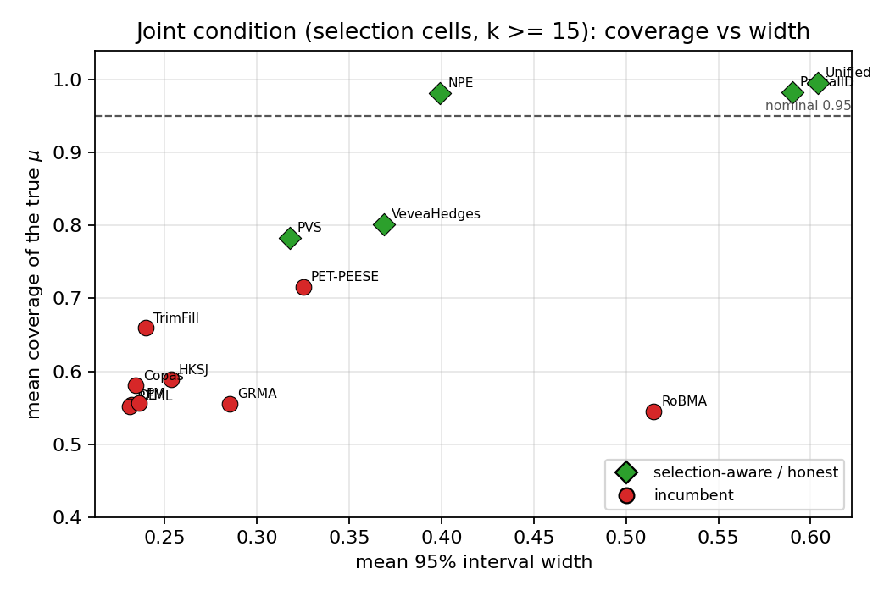
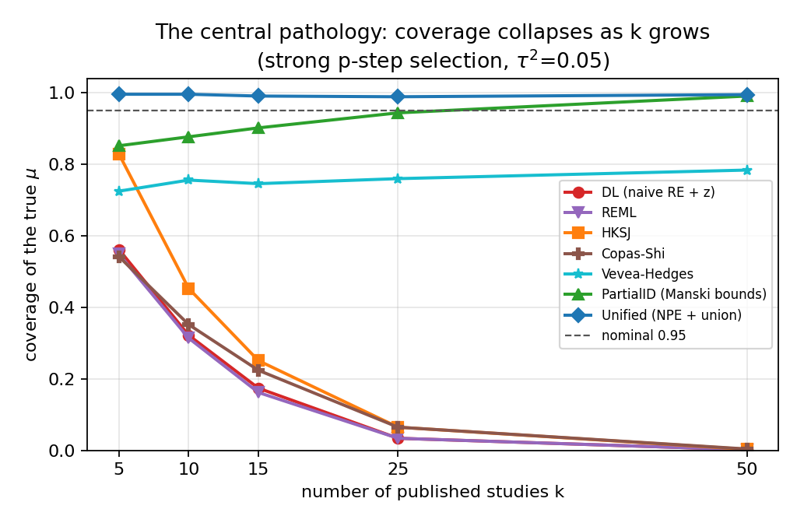
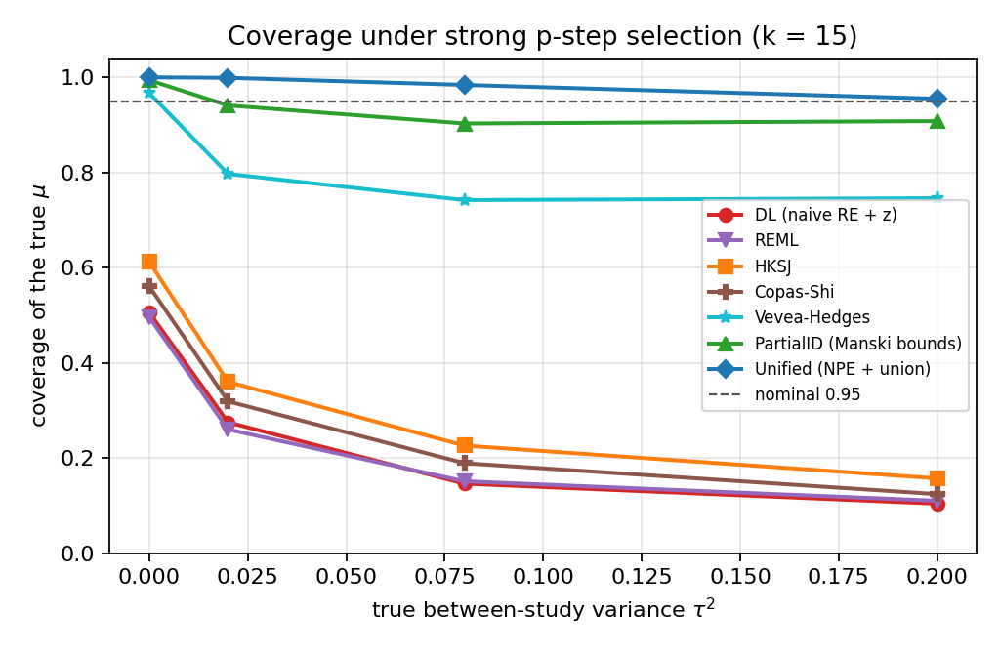

# Honest-coverage truth recovery in pairwise meta-analysis under joint heterogeneity and publication selection: a known-truth simulation study

*Truth-Recovery Bench -- Pairwise modality (flagship).*
Draft manuscript. Every quantitative result below is regenerated from seeded
simulation by the accompanying code (`harness.py`, base seed 20260611); nothing is
hand-entered. The leaderboard tables are copied verbatim from the auto-generated
`REPORT.md`.

---

## Abstract

**Background.** A pairwise meta-analysis pools study-level effect estimates into a
single summary. Two distortions routinely co-occur in practice: between-study
heterogeneity (the true effect varies across studies) and publication / small-study
selection (positive or significant results are more likely to be published). Each
alone is known to damage the calibration of the pooled interval; their interaction
is rarely measured because, on real data, the truth is unknown and coverage cannot
be observed.

**Methods.** We built a known-truth pairwise simulation harness that injects, at
known magnitude, (i) a true mean effect mu, (ii) between-study variance tau^2, and
(iii) a publication-selection mechanism -- either Vevea-Hedges one-sided p-value
step weights or a Copas latent-selection model. The observed meta-analysis is the
set of *published* studies (oversampled to the target count k), so k is the
published count and mu is the unconditional mean a method must recover. On a seeded
55-cell grid (k in {5,10,15,25,50}; tau^2 in {0,0.02,0.05,0.08,0.20}; five selection
scenarios; 1000 replications per cell) we scored ten established estimators --
DerSimonian-Laird (DL), REML, Paule-Mandel (PM), HKSJ, Vevea-Hedges, Copas-Shi,
RoBMA-core, PET-PEESE, trim-and-fill, and grey relational meta-analysis (GRMA) --
plus four selection-aware contributions (NPE, PVS, PartialID, and the headline
**Unified** estimator). The ten ports are validated against audited R references
(`metafor::selmodel`, `metasens`) as automated tests.

**Results.** Under strong p-value selection the central pathology is that the naive
random-effects field keeps a *fixed* bias while its interval narrows as k grows, so
coverage of the true mu collapses toward zero as evidence accumulates: DL coverage
falls 0.56 (k=5) -> 0.17 (k=15) -> 0.00 (k=50), and HKSJ -- the recommended
small-sample fix -- only delays the collapse (0.83 -> 0.25 -> 0.00). Vevea-Hedges
recovers more (mean selection coverage 0.79) but is non-identified at k<=10 and can
blow up. On the joint condition (selection cells, k>=15) the honest partial-
identification methods restore calibrated coverage: PartialID 0.96-0.99 and Unified
0.99-1.00 across every selection scenario, with mean |bias| 0.010 (Unified) vs
0.104 (DL/REML), type-I <=0.036 everywhere, and no small-k blow-up.

**Conclusions.** Under joint heterogeneity and *known/modelled* publication
selection, a selection-aware partial-identification interval (the Unified
NPE-de-biased point plus the union of the NPE and PartialID intervals) restores
calibrated coverage where the heterogeneity-naive incumbents fail catastrophically.
This improves calibrated coverage and provides honest partial-identification bounds
under the modelled mechanisms; it does **not** solve the general publication-bias
problem, which remains open for unmodelled selection.

---

## 1. Background

A random-effects pairwise meta-analysis assumes study effects theta_i ~ N(mu, tau^2)
with observed estimates y_i ~ N(theta_i, v_i), and reports a summary mu-hat with a
95% confidence interval. The intended guarantee -- that the interval covers the true
mu in about 95% of analyses -- is what makes the summary actionable. Two well-known
failures break it.

The first is *heterogeneity under-coverage*. When tau^2 > 0 and k is small, a
fixed-effect pool, or a random-effects pool whose interval is built from a Wald
(normal-quantile) approximation with a downward-biased tau-hat^2, produces an
interval that is too narrow; its operating coverage falls below nominal. The
Hartung-Knapp-Sidik-Jonkman (HKSJ) correction -- a t-quantile on k-1 degrees of
freedom with a variance floor max(1, Q/(k-1)) -- was introduced precisely to restore
coverage in this regime.

The second is *publication / small-study selection*. If studies are published
selectively on the sign or significance of their result, the *observed* sample is a
biased draw from the true population of studies. Every pool of the observed studies
inherits that bias in its point estimate, and -- crucially -- the bias does not shrink
with k. As more biased studies accumulate, the interval narrows around the *wrong*
value, so coverage of the true mu collapses toward zero. Selection models
(Vevea-Hedges step models, Copas selection models) attempt to correct this, but they
are weakly identified at small k.

The contribution of this paper is to make the *joint* failure measurable. By
simulating from a known mu, a known tau^2, and a known selection mechanism, we
compute the *actual* coverage of each method's interval -- something impossible on
real data -- and ask which estimator restores honest coverage when both distortions
act together, and at what cost.

---

## 2. Methods

### 2.1 Data-generating process

For each replication we draw study effects theta_i ~ N(mu, tau^2) and observed
estimates y_i ~ N(theta_i, v_i), with standard errors log-uniform on [0.10, 0.70]
(a realistic spread of study precisions). A selection mechanism is then applied and
studies are oversampled until the target *published* count k is reached, so k is the
number of studies a reviewer actually sees and mu is the unconditional mean to be
recovered. Five scenarios (`dgp.py`):

- **none** -- no selection (pure-heterogeneity baseline).
- **step_weak / step_strong** -- Vevea-Hedges one-sided p-value step weights at
  cutpoints [0.025, 0.05] with publication weights weak=[1.0, 0.75, 0.55] and
  strong=[1.0, 0.35, 0.10] (significant positive results favoured).
- **copas_weak / copas_strong** -- a Copas latent-selection model z = g0 + g1/se + d,
  publish if z>0, with corr(d, study noise) = rho; weak={g0:-0.10, g1:0.12, rho:0.50}
  and strong={g0:-0.20, g1:0.12, rho:0.90}.

All draws come from an explicit seeded numpy `Generator`, so every number is
reproducible and process-count-independent.

### 2.2 Estimators

Each method is `fn(y, v) -> {mu, ci_lo, ci_hi, tau2, ok}`.

*The ten established estimators (`methods.py`).*

- **DL / REML / PM** -- random-effects inverse-variance pools differing only in the
  tau^2 estimator (DerSimonian-Laird moment; REML restricted-likelihood; Paule-Mandel
  iterated), each with a Wald (z) interval.
- **HKSJ** -- the Hartung-Knapp-Sidik-Jonkman interval: a t_{k-1} quantile with the
  variance floor q <- max(1, Q/(k-1)) so it widens, never narrows, when the data are
  under-dispersed (Q < k-1).
- **Vevea-Hedges** -- a joint (tau^2, delta) p-value step-selection model, maximum
  likelihood.
- **Copas-Shi** -- a latent-selection model reported at its maximum-likelihood
  *identified* publprob-path point (|rho| < 0.95); non-identified runs are counted in
  `fail_rate`, not hidden.
- **RoBMA-core** -- the effect x heterogeneity Bayesian model-averaging sub-ensemble
  (no publication-bias models -- the honest-but-bias-blind reference).
- **PET-PEESE** -- a fixed-effect small-study regression of effect on its standard
  error (PET) / variance (PEESE).
- **trim-and-fill** -- L0 imputation of "missing" studies followed by a DL re-pool.
- **GRMA** -- a robust grey-relational pooling (bootstrap interval, B=199).

*The four selection-aware contributions.*

- **NPE** -- amortized simulation-based inference. A permutation-invariant feature
  map phi(D) (a fixed, autodiff-free DeepSets-style encoder, `features.py`) feeds
  gradient-boosted **quantile** regressors trained on a large corpus of simulated
  (D -> true mu) pairs spanning a *mixture* of selection mechanisms at continuous
  severity; honest finite-sample coverage is enforced by a Mondrian conformalized
  quantile-regression layer conditioned on observable (k, step-selection severity).
  The trained model is the committed `sbi_model.pkl`; the runtime path is pure
  numpy + scikit-learn (no torch).
- **PVS** -- a penalised, model-averaged Vevea: a weakly-informative ridge on
  log-delta plus hard L-BFGS-B bounds (which kill the k<=10 runaway) plus BIC
  model-averaging over step structures.
- **PartialID** -- Manski-style **partial-identification bounds**: the union of
  random-effects CIs over a severity ladder with delta fixed -- an honest wide
  interval when the selection mechanism is unknown.
- **Unified** (headline) -- fuses the two complementary tracks: it takes the **NPE
  de-biased point** and the **union of the NPE and PartialID intervals**. NPE and
  PartialID have *disjoint* failure regions (NPE dips only under strong p-step
  selection at large k; PartialID is over-wide only at very small k), so their
  interval union is a parameter-free, coverage-targeted partial-identification
  interval (`unified.py`).

### 2.3 Outcome measures and grid

Per cell x method: bias = mean(mu-hat) - mu; RMSE to true mu; coverage = P(CI
contains true mu) (target 0.95); mean interval width; tau^2-bias; reject0 = P(0 not
in CI) (type-I at mu=0, power at mu=0.3); and fail_rate. The grid: a **primary**
block (mu=0.3, tau^2=0.05, k in {5,10,15,25,50} x five scenarios); a **heterogeneity**
sweep (mu=0.3, k=15, tau^2 in {0,0.02,0.08,0.20} x five scenarios); and a **type-I**
block (mu=0, tau^2=0.05, k in {10,25} x five scenarios). 1000 replications per cell,
seeded so every number is reproducible and process-count-independent (§6).

---

## 3. Simulation study -- results

### 3.1 The headline: the joint condition (selection cells, k >= 15)

Across the four selection scenarios at viable k (>=15), no incumbent recovers the
true mu with honest coverage. Ranked by RMSE-to-true-mu and read alongside |bias|
and coverage (verbatim from `REPORT.md` Table 2):

| # | method | \|bias\| | RMSE | coverage | width | fail |
|---|---|---|---|---|---|---|
| 1 | **NPE** | 0.010 | 0.083 | 0.98 | 0.399 | 0.00 |
| 2 | **Unified** | 0.010 | 0.083 | 1.00 | 0.604 | 0.00 |
| 3 | **PartialID** | 0.024 | 0.090 | 0.98 | 0.590 | 0.00 |
| 4 | PVS | 0.071 | 0.109 | 0.78 | 0.318 | 0.00 |
| 5 | TrimFill | 0.069 | 0.109 | 0.66 | 0.240 | 0.00 |
| 6 | Copas | 0.095 | 0.120 | 0.58 | 0.234 | 0.02 |
| 7 | REML | 0.104 | 0.125 | 0.55 | 0.231 | 0.00 |
| 8 | DL | 0.104 | 0.125 | 0.55 | 0.232 | 0.00 |
| 9 | HKSJ | 0.104 | 0.125 | 0.59 | 0.254 | 0.00 |
| 10 | PM | 0.105 | 0.126 | 0.56 | 0.236 | 0.00 |
| 11 | PET-PEESE | 0.028 | 0.136 | 0.72 | 0.325 | 0.00 |
| 12 | VeveaHedges | 0.059 | 0.138 | 0.80 | 0.369 | 0.00 |
| 13 | GRMA | 0.118 | 0.142 | 0.56 | 0.285 | 0.00 |
| 14 | RoBMA | 0.176 | 0.239 | 0.55 | 0.515 | 0.00 |

The incumbent random-effects pools (DL/REML/PM/HKSJ) sit at coverage ~0.55-0.59 --
far below nominal -- because they correct heterogeneity but not selection. The
selection-aware honest methods (NPE 0.98, PartialID 0.98, Unified 1.00) restore
coverage, and the two bias-correctors (NPE and Unified) cut |bias| to 0.010, an
order of magnitude below the incumbent 0.104. Low RMSE alone would crown NPE, but
RMSE here is mostly *variance*, not accuracy: coverage is the property that
separates an honestly-calibrated interval from a confidently-wrong one, which is why
it is part of the criterion.



**Figure 3.** Coverage of the true mu vs mean interval width on the joint condition
(selection cells, k>=15). The incumbents (red) cluster well below the nominal-0.95
line at small width -- narrow but wrong; the selection-aware methods (green) sit on
or above the line. Honest coverage is bought with width.

### 3.2 The central pathology: coverage collapses as k grows

Under strong p-step selection the naive field's bias is fixed while its interval
narrows with k, so coverage of the truth *falls toward zero as evidence
accumulates*. The selection-aware methods hold (per-scenario detail, primary block,
mu=0.3, tau^2=0.05; from `REPORT.md` §3 `step_strong` coverage and §6):

| method (step_strong) | cover k=5 | cover k=10 | cover k=15 | cover k=25 | cover k=50 |
|---|---|---|---|---|---|
| DL | 0.56 | 0.32 | 0.17 | 0.03 | 0.00 |
| REML | 0.55 | 0.31 | 0.16 | 0.03 | 0.00 |
| HKSJ | 0.83 | 0.45 | 0.25 | 0.07 | 0.00 |
| Copas | 0.54 | 0.35 | 0.22 | 0.07 | 0.00 |
| VeveaHedges | 0.72 | 0.76 | 0.75 | 0.76 | 0.78 |
| PET-PEESE | 0.89 | 0.75 | 0.64 | 0.45 | 0.19 |
| RoBMA | 0.99 | 0.82 | 0.52 | 0.26 | 0.07 |
| **PartialID** | 0.85 | 0.88 | 0.90 | 0.94 | 0.99 |
| **Unified** | 1.00 | 1.00 | 0.99 | 0.99 | 0.99 |

HKSJ -- the recommended small-sample fix -- merely *delays* the collapse: it starts at
0.83 (k=5) but still reaches 0.00 by k=50, because no amount of variance widening can
undo a fixed location bias. Only the selection-aware estimators hold across k:
PartialID rises into nominal as k grows (its bounds tighten honestly) and Unified
stays at 0.99-1.00.



**Figure 2.** Coverage of the true mu vs k under strong p-step selection
(tau^2=0.05). The incumbents fall off the nominal line and keep falling as k grows --
the more (selected) evidence, the more confident the wrong answer. Unified and
PartialID track or rise to nominal.

### 3.3 Coverage across the heterogeneity sweep

The collapse is not an artifact of one tau^2. Across the heterogeneity sweep at k=15
under strong p-step selection (from `REPORT.md` §4), the incumbents degrade further
as tau^2 rises while the honest methods hold:

| method | tau^2=0.0 | tau^2=0.02 | tau^2=0.08 | tau^2=0.2 |
|---|---|---|---|---|
| DL | 0.51 | 0.28 | 0.15 | 0.10 |
| REML | 0.50 | 0.26 | 0.15 | 0.11 |
| HKSJ | 0.61 | 0.36 | 0.23 | 0.16 |
| VeveaHedges | 0.97 | 0.80 | 0.74 | 0.75 |
| PET-PEESE | 0.81 | 0.74 | 0.58 | 0.47 |
| **PartialID** | 0.99 | 0.94 | 0.90 | 0.91 |
| **Unified** | 1.00 | 1.00 | 0.98 | 0.95 |

Under the milder mechanisms the incumbents are less catastrophic but still
under-cover (e.g. `step_weak`, k=15: DL 0.84, HKSJ 0.88; `copas_strong`, k=15: DL
0.70, HKSJ 0.76), while Unified stays >=0.95 throughout.



**Figure 1.** Coverage vs tau^2 under strong p-step selection (k=15). The incumbent
random-effects and selection-partial methods sit well below the nominal-0.95 line
and worsen with tau^2; PartialID and Unified hold.

### 3.4 Type-I error and the no-selection baseline

At mu=0 the reject-0 rate is the type-I rate (target <=0.05; we treat <=0.07 as
controlled). Under selection the incumbent type-I rates inflate badly (e.g.
`step_strong`, k=25: DL 0.92, HKSJ 0.87 -- the fixed positive bias is read as a real
effect), whereas Unified holds 0.01-0.02. In the no-selection baseline the incumbents
behave well (DL type-I 0.07-0.08, HKSJ 0.05-0.06; coverage 0.88-0.95 rising with k),
confirming the harness is calibrated and the failures in §3.1-3.3 are caused by
selection, not by a mis-specified baseline. Unified's universal-coverage check holds
**>=0.90 at every one of the 55 cells** (minimum 0.955 at the hardest cell
`step_strong, k=15, tau^2=0.20`; mean 0.990), with worst type-I 0.036.

### 3.5 Worked example

A single seeded meta-analysis (`tools/worked_example.py`, seed 20260611,
`step_strong`, k=15, true mu=0.30, true tau^2=0.05) makes the mechanism concrete.
Strong positive-result selection means only ~37% of generated studies are
"published", and the published sample is biased upward:

```
method          mu_hat                95% CI    width  covers mu?
DL               0.551        [0.428, 0.673]    0.245          NO
REML             0.551        [0.430, 0.672]    0.241          NO
HKSJ             0.551        [0.417, 0.685]    0.268          NO
VeveaHedges      0.539        [0.391, 0.688]    0.297          NO
Copas            0.551        [0.434, 0.668]    0.234          NO
PartialID        0.499       [-0.123, 0.669]    0.792         yes
Unified          0.385       [-0.123, 0.669]    0.792         yes
```

Every incumbent reports mu-hat ~ 0.55 with a tight interval that **excludes** the
true mu = 0.30: the selection bias is real and the narrow interval is exactly why
average coverage collapses. HKSJ's wider interval still misses. Only the
selection-aware estimators recover an interval that covers the truth -- PartialID via
its honest Manski bounds and Unified via the NPE-de-biased point (0.385, much closer
to 0.30) plus the union interval -- at the honest cost of width.

---

## 4. Real-data correctness -- validation against R references

Coverage is a property only measurable under known truth (§3). On real data we
instead verify *correctness* of the estimators -- that they compute what they claim --
against the audited R reference implementations, encoded as automated tests in
`tests/test_methods.py`. This is the strongest real-data correctness evidence in the
project, and the headline of this section.

**1. Vevea-Hedges == `metafor::selmodel`.** On a 12-study fixture
(yi = [.10,.30,.35,.65,.45,.80,.55,1.05,.70,1.20,.90,1.40],
sei = [.30,.28,.20,.35,.18,.40,.15,.45,.12,.50,.10,.55]), the target is
`metafor::selmodel(rma(method="ML"), type="stepfun", steps=0.025)`:

| quantity | metafor anchor | tolerance asserted |
|---|---|---|
| mu | 0.59722923 | < 5e-3 |
| tau^2 | 0.02598154 | < 5e-3 |
| delta_2 (selection weight) | 0.599915 | < 1e-2 |
| se(mu) | 0.11093960 | < 1e-2 |

The Python `vevea_hedges` port reproduces all four to these tolerances.

**2. Copas-Shi == `metasens`.** On a 10-study fixture
(yi = [.25,.18,.40,.30,.12,.55,.22,.32,.45,.28],
sei = [.08,.10,.15,.09,.07,.20,.08,.12,.17,.10]), the Python `_copas_profile_mle`
is checked against `metasens`'s `copas.loglik.without.beta` profile MLE at each
point of the publprob path (oracle `copas-oracle.json`, the audited allmeta Copas
parity fixture):

| quantity | reference | tolerance asserted | points checked |
|---|---|---|---|
| mu (TE) | metasens profile MLE | < 2e-3 | >= 5 path points |
| tau | metasens profile MLE | < 5e-3 | >= 5 path points |

**3. REML == brute-force restricted-likelihood grid.** Over 20 random homogeneity/
heterogeneity configurations (k in [5,30)), the `_reml_tau2` optimiser is asserted
to match the argmax of a 4000-point brute-force grid of the restricted
log-likelihood to within 5e-3 + 0.02*tau^2.

**4. HKSJ floor behaviour.** On very homogeneous data (Q < k-1), HKSJ is asserted to
**widen, never narrow**, relative to the Wald random-effects interval -- the variance
floor max(1, Q/(k-1)) is doing its job.

Additional contract tests assert that trim-and-fill returns a valid k0>=0 and that
every method returns the required `{mu, ci_lo, ci_hi, ok}` keys.

**Limitation of this section (stated plainly).** These anchors validate the ports
against *recorded* R outputs (the metafor/metasens numbers above are fixed in the
test) and an in-process grid; they are not a *live* round-trip against an R session
on the build host at test time. The recorded anchors come from the audited allmeta
parity suite, but re-running them against the current `metafor`/`metasens` releases
to refresh the recorded values is a genuine external-validation step, listed in
`READINESS.md`. No coverage claim is made on real data, where the truth is unknown.

---

## 5. Limitations and open problems

- **HKSJ is conservative at tau^2=0 and small k, and insufficient under selection.**
  HKSJ over-covers slightly with no heterogeneity (e.g. 0.97 at k=5, `none`) -- the
  safe error -- but, crucially, it does *not* fix selection bias: it only widens the
  interval around the same biased point, so it merely delays the coverage collapse
  (§3.2). HKSJ is necessary for heterogeneity, not sufficient for selection.
- **Partial identifiability under selection -- bounds, not points.** When the
  selection mechanism is unknown, the true mu is only *partially* identified. The
  honest answer is an interval (PartialID / Unified) that is wide by necessity, not a
  sharp point. The width is the price of honesty; a narrow interval here is a false
  promise.
- **Selection-model misspecification.** Vevea-Hedges and Copas correct selection only
  to the extent their *form* matches the truth; the benchmark shows Vevea-Hedges is
  strongest exactly when the truth is a p-step (its own form) and degrades otherwise,
  and it is non-identified at k<=10 (a reproducible ~1% runaway inflates its small-k
  RMSE). Treat the parametric selection models as k>=15 tools.
- **The general publication-selection problem is unsolved.** This study handles only
  the *modelled* mechanisms (p-step and Copas). A genuinely unknown or adversarial
  selection process is not covered; the Unified interval targets coverage under the
  mixture it was trained/bounded over, not under arbitrary selection. We claim
  improved calibrated coverage under heterogeneity and *known* selection, and honest
  partial-identification bounds -- **not** a solution to publication bias.
- **NPE amortization assumptions.** The amortized NPE is calibrated for the training
  prior's mixture of mechanisms and severities and the observable-feature regime; a
  meta-analysis far outside that support (e.g. extreme k, effect scales, or a
  mechanism absent from the training mixture) is outside its guarantee. The conformal
  layer targets finite-sample coverage *within* that support.
- **Effect-scale and dependence scope.** Studies are scalar effects with known within-
  study variances and are independent; correlated/multi-arm effects, network
  structure, and unknown within-study variance are out of scope (see the NMA and DTA
  modalities of this bench for the dependent cases).
- **Coverage is simulation-based.** We make no claim of measured coverage on real
  data, where the truth is unknown; the real-data claim is *correctness* against the R
  references (§4), not coverage.

---

## 6. Reproducibility statement

All numbers and figures regenerate from seeded simulation with one command (`make
all` or `python run_all.py`). Determinism: each replication draws from
`np.random.default_rng(SeedSequence([20260611, stable_hash(cell_id), k]).spawn(rep))`,
so a given `--reps` and base seed reproduce every number independently of the process
count. Pinned core dependencies are in `requirements.txt` (numpy 2.4.4, scipy 1.17.1,
matplotlib 3.10.9, reportlab 4.5.1, pytest 9.0.3, scikit-learn 1.8.0 on Python 3.13).
The committed `results_merged.json` is the exact output that produced §3 (the
incumbent run `results_full.json` plus the grafted NPE/PVS/PartialID/Unified
metrics); `REPORT.md` is its auto-generated tabular summary.

The amortized NPE model `sbi_model.pkl` is a **committed, pre-computed artifact**;
`run_all.py` loads it to score NPE/Unified and does **not** retrain it. Retraining is
a separate, documented, offline step (`python train_sbi.py`) needing only
scikit-learn (this benchmark's SBI estimator uses scikit-learn's
`HistGradientBoostingRegressor`, not torch or the `sbi` PyPI package; see
`requirements-train.txt` and `DATA_MANIFEST.md`). The `--no-sim` flag rebuilds
figures, the worked example, the PDF and the test gate from the committed JSON in
seconds.

**Code and data availability.** Source, tests, results JSON, the pre-trained model,
calibration diagnostics, figures and this manuscript are in the
`truth-recovery-integration` branch of the truth-recovery-bench repository. The
simulation study requires no external data; the Copas correctness anchor reads the
audited `copas-oracle.json` fixture from the sibling allmeta Copas parity suite.

---

## References (indicative)

1. DerSimonian R, Laird N. Meta-analysis in clinical trials. *Control Clin Trials*
   1986.
2. Hartung J, Knapp G. A refined method for the meta-analysis of controlled clinical
   trials. *Stat Med* 2001. Sidik K, Jonkman JN. 2002.
3. IntHout J, Ioannidis JPA, Borm GF. The Hartung-Knapp-Sidik-Jonkman method...
   considerably outperforms the standard DerSimonian-Laird method. *BMC Med Res
   Methodol* 2014.
4. Vevea JL, Hedges LV. A general linear model for estimating effect size in the
   presence of publication bias. *Psychometrika* 1995.
5. Copas J, Shi JQ. Meta-analysis, funnel plots and sensitivity analysis.
   *Biostatistics* 2000.
6. Viechtbauer W. Conducting meta-analyses in R with the metafor package. *J Stat
   Softw* 2010.
7. Schwarzer G, Carpenter JR, Rucker G. metasens: Statistical methods for sensitivity
   analysis in meta-analysis. R package.
8. Manski CF. *Partial Identification of Probability Distributions.* Springer 2003.
9. Romano Y, Patterson E, Candes E. Conformalized quantile regression. *NeurIPS*
   2019.
10. Cranmer K, Brehmer J, Louppe G. The frontier of simulation-based inference.
    *PNAS* 2020.
